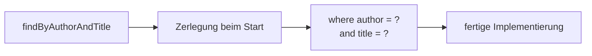

# Abgeleitete Abfragen

## Die Ausgangslage

Dein Repository ist nur ein Interface:

```java
public interface GuestbookEntryRepository extends JpaRepository<GuestbookEntry, Long> {
}
```

Damit hast du bereits `save()`, `findById()`, `findAll()`, `deleteById()` und einige weitere. Was du **nicht** hast, sind fachliche Abfragen: „alle Einträge eines bestimmten Verfassers", „alle Einträge aus einem Zeitraum", „alle Einträge, deren Titel ein Wort enthält".

Ohne Hilfsmittel müsstest du dafür SQL schreiben. Spring Data bietet einen anderen Weg: Du **benennst** die Methode, und die Implementierung entsteht daraus.

:::info Das Prinzip
**Der Methodenname ist die Abfrage.** Spring Data liest ihn beim Start, zerlegt ihn und baut daraus das SQL. Es gibt keinen Rumpf zu schreiben.
:::

## Wie der Name gelesen wird

```java
List<GuestbookEntry> findByAuthor(String author);
```

Spring Data zerlegt das so:

```text
findBy      Author
──────      ──────
Einleitung  Attribut der Entität
            → where author = ?
```

Wichtig ist der **zweite Teil**: `Author` muss ein Attribut der Entität sein. Es wird kleingeschrieben und in die Bedingung übernommen.



:::danger Ein Tippfehler fällt beim Start auf — nicht beim Kompilieren
Schreibst du `findByAutor` statt `findByAuthor`, kompiliert das Projekt einwandfrei. Beim **Start** bricht es mit einer Meldung wie:

```text
No property 'autor' found for type 'GuestbookEntry'
```

Das ist unangenehm, aber immer noch besser als bei handgeschriebenem SQL in einer Zeichenkette: Dort fiele der Fehler erst auf, wenn ein Nutzer die betroffene Funktion aufruft.
:::

## Die Bausteine

### Einleitungen

| Präfix | Ergebnis |
|---|---|
| `findBy…` | die Treffer |
| `countBy…` | die Anzahl |
| `existsBy…` | `true` / `false` |
| `deleteBy…` | löscht die Treffer |

### Vergleiche

| Baustein | SQL | Beispiel |
|---|---|---|
| *(nichts)* | `= ?` | `findByAuthor` |
| `Not` | `<> ?` | `findByAuthorNot` |
| `Containing` | `like %?%` | `findByTitleContaining` |
| `StartingWith` | `like ?%` | `findByAuthorStartingWith` |
| `GreaterThan` | `> ?` | `findByDateGreaterThan` |
| `LessThan` | `< ?` | `findByDateLessThan` |
| `Between` | `between ? and ?` | `findByDateBetween` |
| `After` / `Before` | `> ?` / `< ?` | `findByDateAfter` |
| `IsNull` | `is null` | `findByCommentIsNull` |
| `In` | `in (?, ?, …)` | `findByAuthorIn` |
| `IgnoreCase` | Groß-/Kleinschreibung egal | `findByAuthorIgnoreCase` |

### Verknüpfungen und Sortierung

| Baustein | Wirkung |
|---|---|
| `And` | beide Bedingungen | 
| `Or` | eine von beiden |
| `OrderBy…Asc` / `…Desc` | Sortierung |
| `First` / `Top10` | begrenzt die Trefferzahl |
| `Distinct` | keine Doppelungen |

### Beispiele

```java
// alle Einträge eines Verfassers, neueste zuerst
List<GuestbookEntry> findByAuthorOrderByDateDesc(String author);

// Titel enthält ein Wort, Groß-/Kleinschreibung egal
List<GuestbookEntry> findByTitleContainingIgnoreCase(String wort);

// alle aus einem Zeitraum, seitenweise
Page<GuestbookEntry> findByDateBetween(LocalDateTime from, LocalDateTime to, Pageable pageable);

// die drei neuesten
List<GuestbookEntry> findTop3ByOrderByDateDesc();

// wie viele hat jemand geschrieben?
long countByAuthor(String author);

// gibt es überhaupt einen?
boolean existsByAuthor(String author);
```

:::tip Lass dir die Möglichkeiten vorschlagen
Tippe im Repository `findBy` und warte. Deine Entwicklungsumgebung kennt die Attribute deiner Entität und schlägt gültige Fortsetzungen vor.

Das ist der schnellste Weg, ein Gefühl für die Möglichkeiten zu bekommen — schneller als jede Tabelle.
:::

## Sortierung: im Namen oder als Parameter?

Für „neueste zuerst" gibt es zwei Wege:

```java
// (a) fest im Namen
List<GuestbookEntry> findByAuthorOrderByDateDesc(String author);

// (b) beweglich als Parameter
List<GuestbookEntry> findByAuthor(String author, Sort sort);
```

| | im Namen | als Parameter |
|---|---|---|
| Sortierung | fest | vom Aufrufer bestimmbar |
| Lesbarkeit | selbsterklärend | Name bleibt kurz |
| Geeignet, wenn | die Reihenfolge zur Fachlichkeit gehört | der Client sortieren darf |

Bei einer REST-Schnittstelle, deren Client `?sort=author,asc` schicken darf, ist (b) richtig. Deshalb arbeitet dein Gästebuch mit `Pageable` — darin steckt die Sortierung schon.

## Wenn der Name zu lang wird

Abgeleitete Abfragen haben eine Grenze. Diese Methode ist theoretisch möglich:

```java
List<GuestbookEntry> findByAuthorAndTitleContainingAndDateBetweenOrderByDateDesc(
        String author, String titel, LocalDateTime from, LocalDateTime to);
```

Lesbar ist sie nicht mehr. Ab etwa **drei Bedingungen** greift man besser zu `@Query`:

```java
@Query("""
        select e from GuestbookEntry e
        where e.author = :author
          and lower(e.title) like lower(concat('%', :titel, '%'))
        order by e.date desc
        """)
List<GuestbookEntry> sucheEintraege(String author, String titel);
```

Das ist **JPQL** — eine Abfragesprache, die wie SQL aussieht, aber über **Klassen und Attribute** formuliert wird, nicht über Tabellen und Spalten. Beachte `GuestbookEntry` und `e.author` statt `guestbook_entry` und `author`.

:::info Wann was?
| Situation | Wahl |
|---|---|
| eine bis zwei Bedingungen | abgeleitete Abfrage |
| drei und mehr | `@Query` mit JPQL |
| Berechnungen, Gruppierungen | `@Query` |
| datenbankspezifische Funktionen | `@Query` mit `nativeQuery = true` |
:::

## Nachsehen, was wirklich passiert

Bei aller Bequemlichkeit gilt: Du siehst das erzeugte SQL nicht — es sei denn, du schaust hin.

```properties
spring.jpa.show-sql=true
spring.jpa.properties.hibernate.format_sql=true
```

Damit steht jede Abfrage im Log. Das ist der einzige verlässliche Weg zu prüfen, ob wirklich die Datenbank filtert.

:::warning Der häufigste Anfängerfehler
Alles holen und in Java filtern:

```java
repository.findAll().stream()
          .filter(e -> e.getAuthor().equals(author))   // ❌
          .toList();
```

Im Log erscheint dann ein `select` **ohne** `where` — die ganze Tabelle wird übertragen. Mit `findByAuthor(author)` erledigt die Datenbank die Auswahl.
:::

:::note Das hast du gelernt
- Bei einer **abgeleiteten Abfrage** ist der Methodenname die Abfrage; Spring Data erzeugt die Implementierung beim Start.
- Der Name besteht aus Einleitung (`findBy`, `countBy`, `existsBy`), Attributnamen und Vergleichsbausteinen.
- Ein Tippfehler im Attributnamen fällt erst **beim Start** auf, nicht beim Kompilieren.
- Sortierung gehört in den Namen, wenn sie fachlich festliegt — sonst als `Sort`- bzw. `Pageable`-Parameter.
- Ab etwa drei Bedingungen ist `@Query` mit **JPQL** lesbarer.
- Nur das Log zeigt, ob wirklich die Datenbank filtert.
:::
