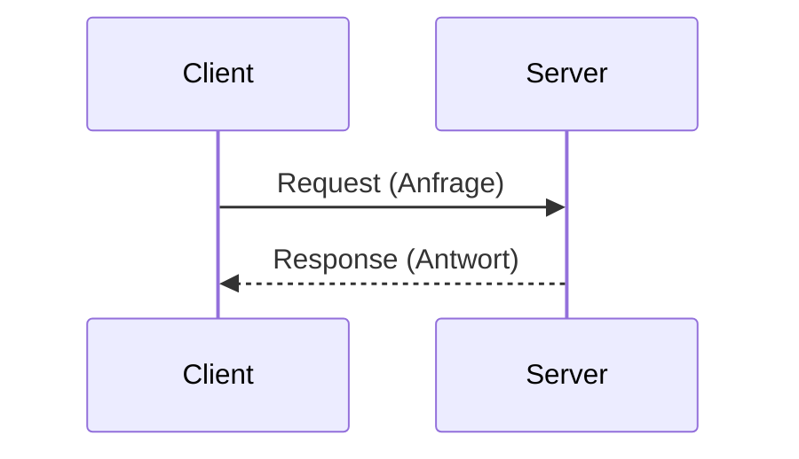
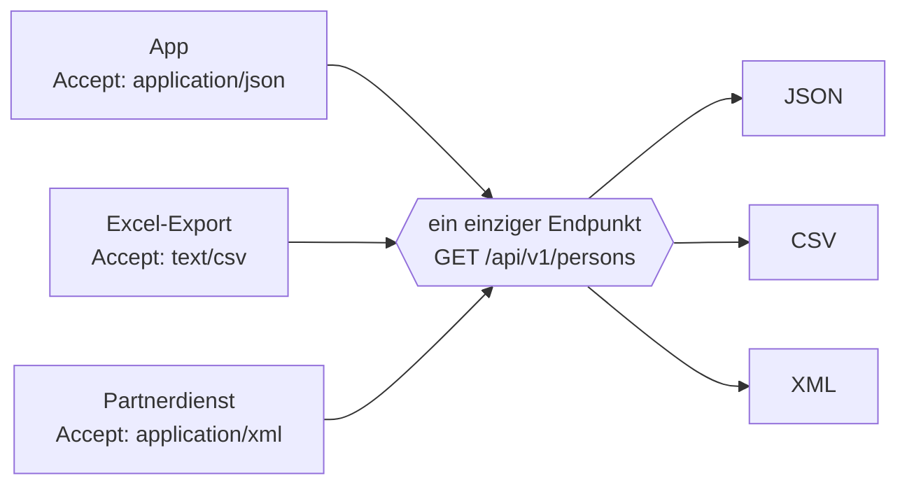

# HTTP kompakt

HTTP ist die Sprache, in der Client und Server miteinander reden. Jeder Webservice-Aufruf ist eine HTTP-Nachricht. Wer HTTP versteht, kann jede REST-API lesen.

## Ein Aufruf besteht aus zwei Nachrichten



Mehr passiert nicht. Der Client fragt, der Server antwortet, die Verbindung ist erledigt. Für die nächste Frage beginnt alles von vorn — genau das meint **Zustandslosigkeit**.

## Aufbau einer Anfrage

```http
POST /api/v1/persons HTTP/1.1        ← Startzeile: Methode, Pfad, Version
Host: localhost:8080                  ┐
Content-Type: application/json        │ Header (Kopfzeilen)
Accept: application/json              ┘
                                      ← Leerzeile trennt Kopf und Rumpf
{"firstname":"Anna","surname":"Schmidt"}   ← Body (Rumpf, optional)
```

| Teil | Bedeutung |
|---|---|
| **Methode** | Was soll passieren? `GET`, `POST`, `PUT`, `DELETE` … |
| **Pfad** | Womit? Die Adresse der Ressource |
| **Header** | Zusatzangaben — Datenformat, Anmeldung, Sprache … |
| **Body** | Die mitgeschickten Daten. Bei `GET` und `DELETE` normalerweise leer |

## Aufbau einer Antwort

```http
HTTP/1.1 201 Created                  ← Statuszeile: Code und Kurztext
Content-Type: application/json        ┐ Header
Location: /api/v1/persons/1           ┘
                                      ← Leerzeile
{"id":1,"firstname":"Anna","surname":"Schmidt"}   ← Body
```

## Die HTTP-Methoden

| Methode | Zweck | CRUD | Body in der Anfrage? |
|---|---|---|:--:|
| `GET` | Daten abrufen | Read | nein |
| `POST` | Neue Ressource anlegen | Create | ja |
| `PUT` | Ressource **vollständig** ersetzen | Update | ja |
| `PATCH` | Ressource **teilweise** ändern | Update | ja |
| `DELETE` | Ressource löschen | Delete | nein |

:::tip PUT oder PATCH?
`PUT` schickt den **kompletten** neuen Stand — fehlende Felder werden geleert.
`PATCH` schickt **nur die Änderung** — alles andere bleibt.

Für eine Person mit Vor- und Nachnamen:
- `PUT` mit `{"firstname":"Anna"}` → der Nachname wäre danach leer.
- `PATCH` mit `{"firstname":"Anna"}` → der Nachname bleibt stehen.

In diesen Tutorials verwenden wir `PUT`.
:::

## Statuscodes

Jede Antwort trägt einen dreistelligen Code. Die **erste Ziffer** sagt schon das Wichtigste:

| Gruppe | Bedeutung | Merkhilfe |
|---|---|---|
| **1xx** | Information | „Moment noch…" |
| **2xx** | Erfolg | „Hat geklappt." |
| **3xx** | Umleitung | „Schau woanders nach." |
| **4xx** | Fehler beim **Client** | „**Du** hast Mist gebaut." |
| **5xx** | Fehler beim **Server** | „**Ich** habe Mist gebaut." |

:::warning Die wichtigste Unterscheidung
**4xx heißt: Der Client ist schuld** — falsche Adresse, fehlende Daten, keine Berechtigung. Wiederholen bringt nichts, solange die Anfrage nicht geändert wird.

**5xx heißt: Der Server ist schuld.** Dieselbe Anfrage kann gleich schon funktionieren.
:::

### Die Codes, die du brauchst

| Code | Text | Wann |
|---|---|---|
| `200` | OK | Anfrage erfolgreich, Antwort enthält Daten |
| `201` | Created | Ressource wurde angelegt. Sollte im `Location`-Header die Adresse der neuen Ressource mitschicken |
| `204` | No Content | Erfolgreich, aber es gibt nichts zurückzugeben — typisch nach `DELETE` |
| `400` | Bad Request | Die Anfrage ist fehlerhaft aufgebaut |
| `401` | Unauthorized | Nicht angemeldet. *(Der Name ist irreführend — es geht um Authentifizierung.)* |
| `403` | Forbidden | Angemeldet, aber nicht berechtigt |
| `404` | Not Found | Die angeforderte Ressource gibt es nicht |
| `405` | Method Not Allowed | Ressource existiert, aber nicht mit dieser Methode |
| `406` | Not Acceptable | Der Server kann kein Format liefern, das der Client im `Accept`-Header verlangt |
| `409` | Conflict | Widerspruch zum aktuellen Zustand, z. B. E-Mail schon vergeben |
| `415` | Unsupported Media Type | Der Server versteht das Format des mitgeschickten Bodys nicht |
| `500` | Internal Server Error | Unerwarteter Fehler im Server |

:::danger Häufiger Fehler
Ein Server, der bei einem nicht gefundenen Datensatz `200 OK` mit dem Inhalt `null` zurückgibt.

Der Client muss dann **raten**, ob alles gut ging. Genau dafür gibt es `404`.
:::

## Wichtige Header

| Header | Richtung | Bedeutung |
|---|---|---|
| `Content-Type` | beide | In welchem Format ist der **Body** dieser Nachricht? |
| `Accept` | Anfrage | In welchem Format hätte ich die **Antwort** gern? |
| `Authorization` | Anfrage | Anmeldedaten, meist ein Token |
| `Location` | Antwort | Adresse der neu angelegten Ressource (bei `201`) |

:::tip Content-Type und Accept verwechselt man leicht
`Content-Type` beschreibt, **was ich mitschicke**.
`Accept` beschreibt, **was ich zurückhaben will**.

Bei einem `POST` stehen oft beide in der Anfrage: „Ich schicke JSON *und* möchte JSON zurück."
:::

## Content Negotiation: mehrere Formate

`Content-Type` und `Accept` sind kein Selbstzweck. Über sie handeln Client und Server aus, in welchem Format die Daten übertragen werden. Dieses Aushandeln heißt **Content Negotiation** (Inhaltsverhandlung).

Solange eine API nur JSON kennt, gibt es nichts zu verhandeln. Interessant wird es, sobald ein Endpunkt **mehrere** Formate bedienen kann — etwa JSON für die App, CSV für den Export in die Tabellenkalkulation und XML für einen älteren Partnerdienst:



Dieselbe Ressource, dieselbe URL — das Format bestimmt der Client über den `Accept`-Header. In Spring gibt man die möglichen Formate am Endpunkt an:

```java
@GetMapping(value = "/{id}",
            produces = { MediaType.APPLICATION_JSON_VALUE,
                         MediaType.APPLICATION_XML_VALUE })
public Person getPersonById(@PathVariable Long id) { ... }
```

Für die Gegenrichtung — welche Formate der Endpunkt *annimmt* — gibt es `consumes`:

```java
@PostMapping(consumes = MediaType.APPLICATION_JSON_VALUE)
```

### Was passiert, wenn das Format nicht passt?

Zwei Statuscodes gehören genau hierher, und sie sind leicht zu verwechseln:

| Code | Wer hat das falsche Format? | Auslöser |
|---|---|---|
| `415` Unsupported Media Type | Der **Client** schickt etwas, das der Server nicht lesen kann | `Content-Type: text/plain` bei einem JSON-Endpunkt |
| `406` Not Acceptable | Der **Server** kann nicht liefern, was der Client verlangt | `Accept: application/xml` bei einem JSON-Endpunkt |

Merkhilfe: `415` betrifft die **Hinfahrt** (den Request-Body), `406` die **Rückfahrt** (die Antwort).

:::tip Probiere es aus
Beide Codes kannst du an deiner eigenen Anwendung auslösen, ohne eine Zeile zu ändern:

```bash
# 415 – falsches Format geschickt
curl -i -X POST http://localhost:8080/api/v1/persons \
     -H "Content-Type: text/plain" -d "abc"

# 406 – unmögliches Format verlangt
curl -i -H "Accept: application/xml" http://localhost:8080/api/v1/persons/1
```

Interessant dabei: Deine Endpunkte tragen **kein** `consumes` und **kein** `produces` — und liefern die richtigen Codes trotzdem. Spring erzwingt den Vertrag also schon von sich aus, weil JSON das einzige eingerichtete Format ist.

Genau deshalb sind die beiden Angaben im Normalfall verzichtbar. Sie werden erst nötig, wenn es wirklich mehr als ein Format gibt.
:::

## Fehlerantworten nach RFC 9457

Für Fehler gibt es ein standardisiertes Antwortformat namens *Problem Details*. Es ist am Content-Type `application/problem+json` erkennbar:

```json
{
  "type": "about:blank",
  "title": "Not Found",
  "status": 404,
  "detail": "Keine Person mit der Id 99",
  "instance": "/api/v1/persons/99"
}
```

| Feld | Bedeutung |
|---|---|
| `type` | URI, die den Fehlertyp beschreibt |
| `title` | Kurze, allgemeine Bezeichnung |
| `status` | Der HTTP-Statuscode, noch einmal im Rumpf |
| `detail` | Die konkrete, auf diesen Fall bezogene Meldung |
| `instance` | Welche Anfrage den Fehler ausgelöst hat |

Der Vorteil gegenüber einer selbst erfundenen Struktur: Andere Programme und Werkzeuge kennen dieses Format bereits.

## HTTP sichtbar machen

| Werkzeug | Wofür |
|---|---|
| **Browser-Adresszeile** | Nur `GET`. Schnellster Weg für einen Blick |
| **Entwicklerwerkzeuge** (F12), Reiter *Netzwerk* | Zeigt zu jeder Anfrage Methode, Status, Header und Body |
| **`.http`-Datei in der IDE** | Requests als Textdatei speichern und ausführen — versionierbar |
| **Postman** | Grafisches Werkzeug, gut zum Sammeln und Dokumentieren |
| **`curl`** | Kommandozeile, überall vorhanden, gut für Skripte |

Dieselbe Anfrage in drei Werkzeugen:

```http
### .http-Datei
POST http://localhost:8080/api/v1/persons
Content-Type: application/json

{"firstname":"Anna","surname":"Schmidt"}
```

```bash
# curl
curl -X POST http://localhost:8080/api/v1/persons \
     -H "Content-Type: application/json" \
     -d '{"firstname":"Anna","surname":"Schmidt"}'
```

:::note Das hast du gelernt
- Eine HTTP-Nachricht besteht aus **Startzeile, Headern, Leerzeile und Body**.
- Die **Methode** sagt, was passieren soll; der **Pfad**, womit.
- Die erste Ziffer des Statuscodes trennt **4xx (Client schuld)** von **5xx (Server schuld)**.
- `Content-Type` beschreibt das Mitgeschickte, `Accept` das Gewünschte.
- Über diese beiden Header handeln Client und Server das Format aus (**Content Negotiation**). `415` meint ein unlesbares Format auf der Hinfahrt, `406` ein unmögliches auf der Rückfahrt.
- Fehler werden standardisiert als **Problem Details** (`application/problem+json`) zurückgegeben.
:::
