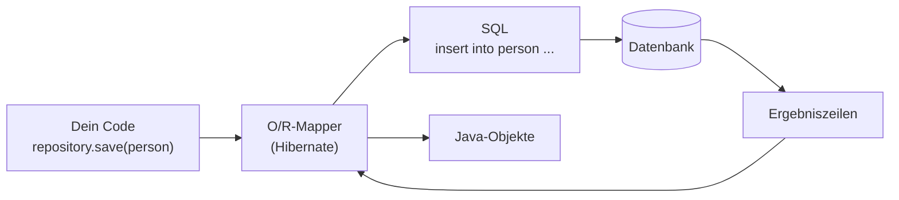
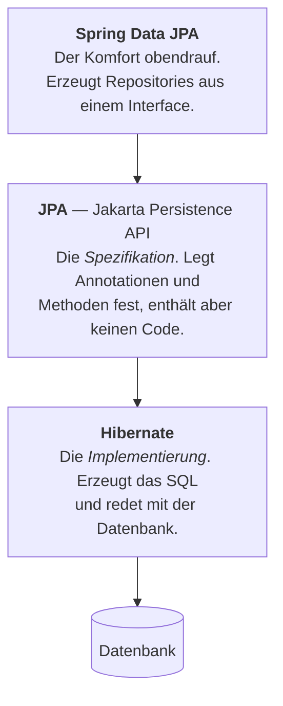

# JPA, Hibernate und die Entität

## Zwei Welten, die nicht zusammenpassen

In Java denkst du in **Objekten**. In einer Datenbank liegen **Tabellen**. Beide speichern Daten — aber nach völlig verschiedenen Regeln.

| | Java-Welt | Datenbank-Welt |
|---|---|---|
| Einheit | Objekt | Zeile in einer Tabelle |
| Beziehung | Referenz (`person.getContact()`) | Fremdschlüssel |
| Sammlung | `List`, `Set` | eigene Tabelle mit Fremdschlüssel |
| Vererbung | gibt es | gibt es **nicht** |
| Identität | Speicheradresse | Primärschlüssel |
| Zugriff | `getFirstname()` | `SELECT firstname FROM ...` |

Sobald Daten dauerhaft gespeichert werden sollen, muss ständig zwischen diesen Welten übersetzt werden. Fachleute nennen den Unterschied den **Impedance Mismatch** — sinngemäß: Die beiden passen nicht bruchlos aufeinander.

## Wie es ohne Hilfsmittel aussieht

Im ersten Lehrjahr hast du das im NHPlus-Projekt selbst geschrieben — eine **DAO**-Klasse mit JDBC:

```java
public Person findById(long id) throws SQLException {
    String sql = "SELECT id, firstname, surname FROM person WHERE id = ?";
    try (PreparedStatement stmt = connection.prepareStatement(sql)) {
        stmt.setLong(1, id);
        ResultSet rs = stmt.executeQuery();
        if (rs.next()) {
            Person p = new Person();
            p.setId(rs.getLong("id"));
            p.setFirstname(rs.getString("firstname"));
            p.setSurname(rs.getString("surname"));
            return p;
        }
        return null;
    }
}
```

Diese 15 Zeilen holen **einen** Datensatz. Dazu kämen `save`, `update`, `delete`, `findAll` — und dasselbe noch einmal für jede weitere Klasse.

:::danger Was daran mühsam ist
- **Viel Code, wenig Inhalt.** Der eigentliche Zweck („hole Person mit dieser Id") verschwindet zwischen Boilerplate.
- **Nichts wird geprüft.** Das SQL steht in einer Zeichenkette. Ein Tippfehler in `firstname` fällt erst zur Laufzeit auf.
- **Jede Änderung wirkt an mehreren Stellen.** Ein neues Attribut bedeutet: Klasse ändern, `SELECT` ändern, `INSERT` ändern, `UPDATE` ändern, das Auslesen ändern.
- **Datenbankabhängig.** Der SQL-Dialekt von H2 ist nicht der von PostgreSQL.
:::

## Was ein objektrelationaler Mapper tut

Ein **objektrelationaler Mapper** (kurz **O/R-Mapper** oder **ORM**) übernimmt genau diese Übersetzung. Du sagst, *was* passieren soll — er erzeugt das passende SQL.



Der O/R-Mapper in deinem Projekt heißt **Hibernate**. Er ist der verbreitetste der Java-Welt.

### Das kannst du selbst beobachten

In deiner `application.properties` steht:

```properties
spring.jpa.show-sql=true
```

Damit schreibt Hibernate jedes erzeugte SQL ins Log. Diese Anweisungen hat er in deinem Projekt tatsächlich erzeugt — ohne dass du eine Zeile SQL geschrieben hättest:

**Beim Start**, aus der Klasse `Person`:

```sql
create sequence person_seq start with 1 increment by 50

create table person (
    id bigint not null,
    firstname varchar(255),
    surname varchar(255),
    primary key (id)
)
```

**Bei `repository.save(person)`** für eine neue Person:

```sql
insert into person (firstname, surname, id) values (?, ?, ?)
```

**Bei `repository.findById(1L)`**:

```sql
select p1_0.id, p1_0.firstname, p1_0.surname
from person p1_0
where p1_0.id = ?
```

**Bei `repository.save(person)`** für eine **vorhandene** Person:

```sql
update person set firstname=?, surname=? where id=?
```

:::tip Beachte den Unterschied
Zweimal derselbe Aufruf `save()` — einmal wird daraus ein `INSERT`, einmal ein `UPDATE`. Hibernate entscheidet das anhand der `id`: Ist sie noch leer, ist das Objekt neu.

Genau solche Entscheidungen nimmt dir ein O/R-Mapper ab.
:::

## Drei Namen, die man ständig verwechselt

In deinem Projekt tauchen drei Bezeichnungen auf, die scheinbar dasselbe meinen. Sie meinen aber **drei verschiedene Ebenen**:



| Name | Was es ist | Woher kommt es |
|---|---|---|
| **JPA** | Eine **Spezifikation** — ein Regelwerk. Definiert `@Entity`, `@Id` und was sie bedeuten sollen. Führt selbst nichts aus. | Jakarta-EE-Standard |
| **Hibernate** | Eine **Implementierung** dieser Regeln. Macht die eigentliche Arbeit. | eigenes Projekt, seit 2001 |
| **Spring Data JPA** | Eine **Bequemlichkeitsschicht** darüber. Erzeugt aus deinem Interface `PersonRepository` eine fertige Klasse. | Spring |

:::info Eine Analogie
**JPA** ist wie die Straßenverkehrsordnung: Sie sagt, was gilt — fährt aber kein Auto.
**Hibernate** ist das Auto, das sich daran hält.
**Spring Data JPA** ist der Fahrdienst, den du anrufst, statt selbst zu fahren.

Deshalb kann man Hibernate theoretisch gegen einen anderen O/R-Mapper austauschen, ohne die Annotationen im Code zu ändern — sie stammen ja aus JPA, nicht aus Hibernate. Du erkennst das an den Import-Zeilen: `jakarta.persistence.Entity`, nicht `org.hibernate...`.
:::

## Die Entität

Eine **Entität** ist eine Java-Klasse, die auf eine Datenbanktabelle abgebildet wird. Aus einer gewöhnlichen Klasse wird sie durch Annotationen.

```java
import jakarta.persistence.Entity;
import jakarta.persistence.GeneratedValue;
import jakarta.persistence.GenerationType;
import jakarta.persistence.Id;

@Entity
public class Person {

    @Id
    @GeneratedValue(strategy = GenerationType.AUTO)
    private Long id;

    private String firstname;
    private String surname;

    public Person() { }
    // Getter und Setter
}
```

### Die Abbildungsregeln

| Im Code | In der Datenbank |
|---|---|
| Klasse `Person` | Tabelle `person` |
| Attribut `firstname` | Spalte `firstname` |
| Attribut mit `@Id` | Primärschlüssel |
| `Long` | `bigint` |
| `String` | `varchar(255)` |

Hibernate leitet die Namen automatisch ab. Aus `PersonAddress` würde die Tabelle `person_address` — Großbuchstaben werden zu Unterstrichen.

:::tip Abweichende Namen
Soll die Tabelle anders heißen als die Klasse, gibt man es an:

```java
@Entity
@Table(name = "supplier_contact")
public class ContactEntity { ... }
```

Analog `@Column(name = "zip")` für eine einzelne Spalte. Das braucht man vor allem bei **bestehenden** Datenbanken, deren Namen man nicht ändern darf.
:::

### Der Primärschlüssel

`@GeneratedValue` bedeutet: Den Wert vergibt die Datenbank, nicht dein Programm.

| Strategie | Verfahren |
|---|---|
| `AUTO` | Hibernate wählt selbst — bei den meisten Datenbanken eine Sequenz |
| `IDENTITY` | Die Datenbank zählt pro Tabelle hoch (`AUTO_INCREMENT`) |
| `SEQUENCE` | Ein eigenes Datenbankobjekt liefert die nächste freie Zahl |

In deinem Projekt steht `AUTO`. Das Log verrät, wofür Hibernate sich entschieden hat:

```sql
create sequence person_seq start with 1 increment by 50
```

Also eine **eigene Sequenz für diese Entität**, mit dem Namen `person_seq`.

:::warning Das `increment by 50` überrascht viele
Hibernate holt sich nicht jede Id einzeln, sondern reserviert **50 auf einmal**. Das spart Datenbankzugriffe, wenn viele Datensätze angelegt werden.

Die Folge: Nach einem Neustart kann die nächste Id einen Sprung machen — etwa von 3 auf 51. Das ist **kein Fehler**. Primärschlüssel müssen eindeutig sein, nicht lückenlos.
:::

### Warum der parameterlose Konstruktor bleiben muss

Hibernate baut Objekte in zwei Schritten: erst ein leeres Objekt erzeugen, dann die Werte aus der Datenbank hineinschreiben. Für den ersten Schritt braucht es einen Konstruktor ohne Parameter.

Fehlt er, scheitert der Start mit einer schwer lesbaren Meldung.

:::danger Deshalb kann eine Entität kein Record sein
Ein Record wäre für eine Datenklasse verlockend — er spart Konstruktor, Getter und `equals()`. Für eine Entität geht es aber nicht, aus drei Gründen:

1. Ein Record hat **nur** den Konstruktor mit allen Werten, keinen parameterlosen.
2. Seine Felder sind `final`. Hibernate muss aber nach dem `INSERT` die erzeugte `id` **nachträglich** hineinschreiben.
3. Ein Record ist `final` und kann nicht abgeleitet werden. Hibernate braucht aber Unterklassen, um Beziehungen erst bei Bedarf nachzuladen.

**Merke:** Records eignen sich für Daten, die sich nicht mehr ändern — also für Antwortobjekte. Entitäten spiegeln einen Zustand, der sich ändert, und bleiben deshalb gewöhnliche Klassen.
:::

## Wer erzeugt eigentlich die Tabelle?

Auch das steuert eine Einstellung:

```properties
spring.jpa.hibernate.ddl-auto=create-drop
```

| Wert | Verhalten |
|---|---|
| `none` | Hibernate fasst das Schema nicht an |
| `validate` | prüft nur, ob Tabellen zu den Entitäten passen |
| `update` | ergänzt Fehlendes, löscht aber nie etwas |
| `create` | legt beim Start alles neu an — vorhandene Daten sind weg |
| `create-drop` | wie `create`, räumt beim Beenden zusätzlich auf |

Bei einer In-Memory-Datenbank ist das unkritisch: Sie ist beim Start ohnehin leer.

:::danger Niemals im Produktivbetrieb
`create` und `create-drop` löschen Daten. `update` kann keine Spalten umbenennen und keine Daten umziehen.

In echten Projekten verwaltet man das Schema deshalb mit Werkzeugen wie **Flyway** oder **Liquibase**, die jede Änderung als versioniertes SQL-Skript festhalten — nachvollziehbar und wiederholbar.
:::

## Was ein O/R-Mapper *nicht* löst

Damit du weißt, was noch kommt:

- **Er nimmt dir SQL nicht dauerhaft ab.** Bei komplexen Auswertungen schreibt man weiterhin Abfragen — dann in JPQL oder direkt in SQL.
- **Bequemlichkeit kann teuer werden.** Wer über eine Liste von Lieferanten läuft und zu jedem die Artikel abruft, erzeugt womöglich hunderte Einzelabfragen. Dieses Muster heißt **N+1-Problem**.
- **Man muss entscheiden, wann verbundene Objekte geladen werden** — sofort oder erst bei Bedarf (*Eager* und *Lazy Loading*).

Beides begegnet dir, sobald Entitäten Beziehungen zueinander haben. In diesem Tutorial gibt es nur eine einzige Klasse — deshalb bleibt es hier einfach.

:::note Das hast du gelernt
- Objekte und Tabellen folgen verschiedenen Regeln; die Übersetzung dazwischen heißt **objektrelationales Mapping**.
- Ein **O/R-Mapper** wie **Hibernate** erzeugt das SQL für dich — sichtbar über `spring.jpa.show-sql=true`.
- **JPA** ist die Spezifikation, **Hibernate** die Implementierung, **Spring Data JPA** der Komfort darüber.
- `@Entity` macht aus einer Klasse eine Tabelle, `@Id` kennzeichnet den Primärschlüssel, `@GeneratedValue` überlässt dessen Vergabe der Datenbank.
- Der **parameterlose Konstruktor** ist Pflicht — deshalb kann eine Entität **kein Record** sein.
- `ddl-auto` steuert, wer das Schema anlegt. Für den Produktivbetrieb nimmt man Flyway oder Liquibase.
:::
