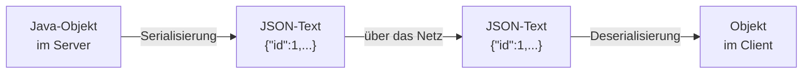

# JSON

## Wozu ein Datenformat?

Zwei Programme wollen Daten austauschen. Das eine ist in Java geschrieben, das andere vielleicht in JavaScript, Python oder C#. Ein Java-Objekt lässt sich aber nicht durch ein Netzwerkkabel schicken — durch eine Leitung geht nur **Text**.

Also braucht es eine Vereinbarung, wie man ein Objekt als Text aufschreibt und wie der Empfänger daraus wieder ein Objekt macht. Diese Vereinbarung ist ein **Datenformat**. Das heute verbreitetste heißt **JSON** (*JavaScript Object Notation*).



:::info Zwei Begriffe, die du brauchst
**Serialisierung** — ein Objekt in Text umwandeln (hinausgehend).
**Deserialisierung** — aus Text wieder ein Objekt bauen (hereinkommend).

In Spring erledigt das eine Bibliothek namens **Jackson**. Du bindest sie nie selbst ein; sie kommt mit `spring-boot-starter-web` automatisch mit.
:::

## Die Bausteine

JSON kennt genau zwei Strukturen und eine Handvoll Datentypen. Mehr nicht — das ist der Grund für seinen Erfolg.

### Das Objekt: geschweifte Klammern

```json
{
  "id": 1,
  "firstname": "Anna",
  "surname": "Schmidt"
}
```

- steht in `{ }`
- enthält **Schlüssel-Wert-Paare**
- Schlüssel und Wert werden durch `:` getrennt
- Paare werden durch `,` getrennt
- der **Schlüssel steht immer in doppelten Anführungszeichen**

### Das Array: eckige Klammern

```json
[
  { "id": 1, "firstname": "Anna",  "surname": "Schmidt" },
  { "id": 2, "firstname": "Ben",   "surname": "Kaya" }
]
```

- steht in `[ ]`
- enthält eine **geordnete Liste** von Werten
- die Werte werden durch `,` getrennt

:::tip Woran du sofort erkennst, was du bekommen hast
Beginnt die Antwort mit `{`, ist es **ein einzelnes Objekt**.
Beginnt sie mit `[`, ist es eine **Liste**.

Deshalb liefert `GET /api/v1/persons/1` etwas mit `{` und `GET /api/v1/persons` etwas mit `[`.
:::

### Die Datentypen

| Typ | Beispiel | Anführungszeichen? |
|---|---|---|
| Zeichenkette | `"Anna"` | **ja** |
| Zahl | `42`, `3.14`, `-7` | nein |
| Wahrheitswert | `true`, `false` | nein |
| leerer Wert | `null` | nein |
| Objekt | `{ "a": 1 }` | — |
| Array | `[1, 2, 3]` | — |

:::warning Die häufigste Fehlerquelle
Zahlen und Wahrheitswerte stehen **ohne** Anführungszeichen. Sobald du sie in Anführungszeichen setzt, sind es Zeichenketten:

```json
{ "alter": 42 }     ← eine Zahl
{ "alter": "42" }   ← eine Zeichenkette, die zufällig aus Ziffern besteht
```

Für ein Programm ist das ein Unterschied: Mit der Zahl kann es rechnen, mit der Zeichenkette nicht.
:::

### Verschachtelung

Werte dürfen selbst wieder Objekte oder Arrays sein. So bildet JSON beliebig tiefe Strukturen ab:

```json
{
  "id": 7,
  "name": "Elektrotechnik Meyer",
  "contact": {
    "street": "Industriestraße 12",
    "postcode": "28199",
    "city": "Bremen"
  },
  "articles": [
    { "aid": 1, "designation": "Kabeltrommel", "price": 24.90 },
    { "aid": 2, "designation": "Schraubendreher", "price": 8.50 }
  ]
}
```

Lies es von außen nach innen: Ein Lieferant hat **einen** Kontakt (Objekt) und **mehrere** Artikel (Array von Objekten).

## Typische Fehler

JSON ist streng. Diese vier Fehler machen alle am Anfang:

| Falsch | Richtig | Warum |
|---|---|---|
| `{ firstname: "Anna" }` | `{ "firstname": "Anna" }` | Schlüssel müssen in Anführungszeichen |
| `{ 'firstname': 'Anna' }` | `{ "firstname": "Anna" }` | nur **doppelte** Anführungszeichen |
| `{ "a": 1, "b": 2, }` | `{ "a": 1, "b": 2 }` | kein Komma hinter dem letzten Paar |
| `// Kommentar` | — | JSON kennt **keine** Kommentare |

:::danger Was du bei einem Syntaxfehler siehst
Schickst du fehlerhaftes JSON an deinen Webservice, antwortet er mit **`400 Bad Request`**. Der Server konnte die Anfrage nicht lesen — der Fehler liegt beim Client.

Bekommst du stattdessen `500`, ist etwas anderes kaputt: Dann hat der Server die Anfrage verstanden und ist erst danach gescheitert.
:::

## JSON und Java: wie sie zusammenpassen

Jackson bildet die beiden Welten aufeinander ab. Die Regel ist einfach: **Attributname = Schlüsselname**.

| Java | JSON |
|---|---|
| Klasse / Record | Objekt `{ }` |
| Attribut bzw. Record-Komponente | Schlüssel-Wert-Paar |
| `String` | Zeichenkette |
| `int`, `long`, `double` | Zahl |
| `boolean` | `true` / `false` |
| `null` | `null` |
| `List<T>`, `Set<T>` | Array `[ ]` |
| Referenz auf ein anderes Objekt | verschachteltes Objekt |

Am Beispiel aus dem Tutorial:

```java
public class Person {
    private Long id;
    private String firstname;
    private String surname;
    // Getter und Setter
}
```

wird zu

```json
{ "id": 1, "firstname": "Anna", "surname": "Schmidt" }
```

Und ein Record ganz genauso:

```java
public record Greeting(String message, LocalDateTime time) { }
```

```json
{ "message": "Willkommen!", "time": "2026-08-17T18:23:05.59" }
```

:::info Woher weiß Jackson die Namen?
Bei einer Klasse liest Jackson die **Getter**: Aus `getFirstname()` wird der Schlüssel `firstname`. Deshalb braucht eine Klasse Getter, damit ihre Werte im JSON auftauchen.

Bei einem **Record** entfällt das — die Komponentennamen stehen bereits in der Deklaration.
:::

## Zwei Fälle, die man leicht verwechselt

```json
[]        ← ein leeres Array: „Es gibt eine Liste, sie ist leer."
null      ← gar nichts: „Hier ist kein Wert."
```

Das ist kein Wortspiel, sondern hat praktische Folgen. Fragt ein Client alle Personen ab und es gibt noch keine, lautet die richtige Antwort:

```http
HTTP/1.1 200 OK
Content-Type: application/json

[]
```

Also Status `200` mit leerem Array — **nicht** `404` und **nicht** `null`. Die Sammlung existiert ja; sie ist nur gerade leer.

## JSON lesbar machen

Server liefern JSON meist in einer einzigen langen Zeile, weil das kürzer ist:

```json
{"id":1,"firstname":"Anna","surname":"Schmidt"}
```

Zum Lesen hilft:

| Werkzeug | Wie |
|---|---|
| **Browser** | Firefox und Chrome zeigen JSON automatisch aufbereitet und aufklappbar an |
| **Entwicklerwerkzeuge** (F12) | Reiter *Netzwerk* → Anfrage anklicken → *Antwort* |
| **IDE** | JSON-Datei öffnen und die Formatierungsfunktion aufrufen |
| **Postman** | zeigt Antworten automatisch formatiert |

:::note Das hast du gelernt
- JSON ist ein **Textformat**, mit dem Programme Daten austauschen.
- Es kennt zwei Strukturen: **Objekt** `{ }` und **Array** `[ ]`.
- Schlüssel stehen immer in **doppelten** Anführungszeichen, Zahlen und Wahrheitswerte nie.
- Kein Komma hinter dem letzten Eintrag, keine Kommentare.
- **Serialisierung** = Objekt → Text, **Deserialisierung** = Text → Objekt. In Spring macht das **Jackson**.
- `[]` heißt „leere Liste", `null` heißt „kein Wert" — das ist nicht dasselbe.
- Fehlerhaftes JSON beantwortet der Server mit **`400`**.
:::
