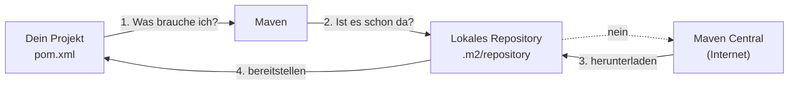

# Maven und Abhängigkeiten

## Das Problem: Software besteht nicht nur aus eigenem Code

Dein Webservice soll HTTP sprechen, JSON lesen, mit einer Datenbank reden und einen Webserver starten. Nichts davon schreibst du selbst — das haben andere schon gebaut und als **Bibliothek** veröffentlicht.

Ohne Hilfsmittel müsstest du:

1. jede Bibliothek als `.jar`-Datei von irgendeiner Website herunterladen,
2. sie in einen Ordner legen und dem Compiler bekannt machen,
3. herausfinden, welche **weiteren** Bibliotheken sie ihrerseits braucht,
4. das alles bei jedem Update wiederholen,
5. und sicherstellen, dass jeder im Team exakt dieselben Versionen hat.

Spätestens bei Schritt 3 wird es unübersichtlich. Genau dafür gibt es **Maven**.

:::info Was Maven ist
Ein **Build-Werkzeug**. Es beschafft die benötigten Bibliotheken, übersetzt den Quelltext, führt die Tests aus und packt am Ende ein auslieferbares Programm.

Die Beschreibung des Projekts steht in einer einzigen Datei: der `pom.xml`.
:::

## Die `pom.xml`

*POM* steht für **P**roject **O**bject **M**odel. Die Datei beschreibt, **was** das Projekt ist und **was es braucht** — nicht, wie gebaut wird. Das weiß Maven selbst.

```xml
<project>
    <parent>
        <groupId>org.springframework.boot</groupId>
        <artifactId>spring-boot-starter-parent</artifactId>
        <version>4.1.0</version>
    </parent>

    <groupId>de.szut</groupId>
    <artifactId>personenverwaltung</artifactId>
    <version>0.0.1-SNAPSHOT</version>

    <properties>
        <java.version>25</java.version>
    </properties>

    <dependencies>
        <dependency>
            <groupId>org.springframework.boot</groupId>
            <artifactId>spring-boot-starter-webmvc</artifactId>
        </dependency>
    </dependencies>
</project>
```

### Die Adresse einer Bibliothek

Jede Bibliothek der Welt ist über drei Angaben eindeutig bestimmt — man nennt sie **GAV-Koordinaten**:

| Angabe | Bedeutung | Beispiel |
|---|---|---|
| **G**roupId | Wer hat es gebaut? Meist eine umgekehrte Domain | `org.springframework.boot` |
| **A**rtifactId | Wie heißt das Bauteil? | `spring-boot-starter-webmvc` |
| **V**ersion | Welcher Stand? | `4.1.0` |

Dein eigenes Projekt hat ebenfalls solche Koordinaten — `de.szut` / `personenverwaltung` / `0.0.1-SNAPSHOT`. Genau die hast du im Spring Initializr eingetragen.

:::tip Warum `SNAPSHOT`?
Der Zusatz kennzeichnet eine Version **in Entwicklung**, die sich noch ändern darf. Eine Version ohne diesen Zusatz gilt als fertig und wird nie wieder verändert.
:::

## Woher die Bibliotheken kommen

Maven lädt sie aus einem **Repository** — einem öffentlichen Archiv im Internet. Der Standard heißt **Maven Central** und enthält Millionen von Bibliotheken.



Heruntergeladene Bibliotheken landen im **lokalen Repository** auf deinem Rechner (`C:\Users\<name>\.m2\repository`). Deshalb dauert der erste Projektstart lange und jeder weitere nur noch Sekunden — beim zweiten Mal ist alles schon da.

## Transitive Abhängigkeiten

Das ist der eigentliche Gewinn. Eine Bibliothek braucht selbst wieder Bibliotheken, und die wieder andere. Maven verfolgt diese Kette automatisch.

Ein Blick in dein eigenes Projekt macht das greifbar:

```text
spring-boot-starter-webmvc
├── spring-boot-starter-jackson
│   └── spring-boot-jackson
│       └── jackson-databind          ← wandelt JSON in Objekte um
│           ├── jackson-annotations
│           └── jackson-core
└── spring-boot-starter-tomcat
    └── tomcat-embed-core             ← der eingebaute Webserver
```

:::info Die Zahl in deinem Projekt
In deiner `pom.xml` stehen **8 Abhängigkeiten**. Tatsächlich lädt Maven **124 JAR-Dateien** — alles Weitere sind transitive Abhängigkeiten.

Das kannst du selbst nachsehen:

```bash
./mvnw dependency:tree
```
:::

Genau deshalb hast du **Jackson** nie eingebunden, obwohl deine Anwendung JSON verarbeitet: Es kommt über `spring-boot-starter-webmvc` mit.

## Starter: fertig geschnürte Bündel

Bibliotheken, deren Name mit `spring-boot-starter-` beginnt, enthalten selbst fast keinen Code. Sie sind **Bündel**, die eine sinnvolle Kombination anderer Bibliotheken zusammenfassen.

| Starter | Bringt mit |
|---|---|
| `spring-boot-starter-webmvc` | Spring MVC, Tomcat, Jackson |
| `spring-boot-starter-data-jpa` | Spring Data JPA, **Hibernate**, Verbindungspool |
| `spring-boot-starter-actuator` | Überwachungs-Endpunkte |

Der Vorteil: Du triffst eine Entscheidung („ich baue eine Web-Anwendung") statt fünfzehn.

## Warum bei den meisten Abhängigkeiten keine Version steht

Ist dir aufgefallen, dass in der `pom.xml` fast überall die `<version>` fehlt? Das liegt am `<parent>`-Eintrag:

```xml
<parent>
    <artifactId>spring-boot-starter-parent</artifactId>
    <version>4.1.0</version>
</parent>
```

Dieser Eltern-POM enthält eine große, geprüfte Liste: Zu Spring Boot 4.1.0 gehört Spring Framework 7.0.8, Jackson 3.1.4, Tomcat 11.0.22 und so weiter. Alle diese Versionen sind aufeinander abgestimmt.

:::warning Eine Version selbst festlegen
Du *kannst* eine Version angeben und damit die Vorgabe überstimmen. Tu es nur, wenn du einen guten Grund hast — du verlässt damit die geprüfte Kombination und kannst schwer auffindbare Fehler erzeugen.
:::

## Der Maven Wrapper

Im Projekt liegen zwei Dateien, die du nicht selbst angelegt hast: `mvnw` (Linux/macOS) und `mvnw.cmd` (Windows). Das ist der **Maven Wrapper**.

Er lädt beim ersten Aufruf genau die Maven-Version herunter, die zum Projekt gehört, und benutzt diese. Ergebnis: Alle bauen mit derselben Version — unabhängig davon, was auf dem einzelnen Rechner installiert ist. Auf manchen Rechnern muss Maven gar nicht erst installiert sein.

```bash
mvnw.cmd clean verify
```

:::tip In Betrieben gilt
Nutze den Wrapper, nicht dein lokales Maven. Er ist der Grund, warum ein Projekt auf dem Rechner der Kollegin genauso baut wie auf deinem und wie auf dem Build-Server.
:::

## Die wichtigsten Befehle

Maven arbeitet in **Phasen**, die aufeinander aufbauen. Ruft man eine Phase auf, laufen alle vorherigen mit.

| Befehl | Was passiert |
|---|---|
| `mvnw clean` | löscht den Ordner `target` mit allen Bauergebnissen |
| `mvnw compile` | übersetzt den Quelltext nach `target/classes` |
| `mvnw test` | compile **+** führt die Tests aus |
| `mvnw package` | test **+** packt eine `.jar`-Datei |
| `mvnw verify` | package **+** zusätzliche Prüfungen |
| `mvnw spring-boot:run` | startet die Anwendung direkt |

:::note `clean` ist kein Allheilmittel, aber oft die Lösung
Wenn sich der Build merkwürdig verhält, obwohl der Code richtig aussieht, liegen häufig alte Bauergebnisse im `target`-Ordner. `mvnw clean verify` baut alles von Grund auf neu.
:::

## Wo die Abhängigkeiten im Projekt landen

| Ordner | Inhalt | In die Versionsverwaltung? |
|---|---|---|
| `src/` | dein Quelltext | **ja** |
| `pom.xml` | die Projektbeschreibung | **ja** |
| `mvnw`, `.mvn/` | der Wrapper | **ja** |
| `target/` | Bauergebnisse, erzeugte `.jar` | **nein** |
| `.m2/repository` | heruntergeladene Bibliotheken | liegt außerhalb des Projekts |

Bibliotheken werden also **nie** ins Projekt kopiert. Weitergegeben wird nur die `pom.xml` — der Rest lässt sich daraus jederzeit wiederherstellen.

:::note Das hast du gelernt
- **Maven** beschafft Bibliotheken, übersetzt, testet und paketiert. Beschrieben wird das Projekt in der `pom.xml`.
- Jede Bibliothek hat **GAV-Koordinaten**: GroupId, ArtifactId, Version.
- Bibliotheken kommen aus **Maven Central** und liegen danach im lokalen Repository.
- **Transitive Abhängigkeiten** zieht Maven automatisch mit — aus 8 Einträgen werden 124 JAR-Dateien.
- **Starter** sind Bündel; die `<parent>`-Angabe legt die abgestimmten Versionen fest.
- Der **Wrapper** (`mvnw`) sorgt dafür, dass alle mit derselben Maven-Version bauen.
- Bibliotheken landen nie im Projektordner — weitergegeben wird die `pom.xml`.
:::
