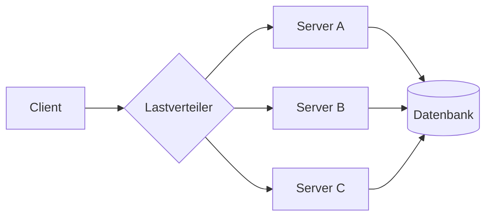
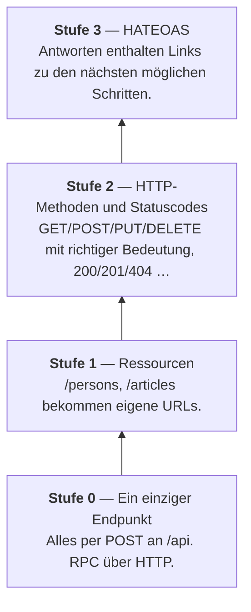

import Tabs from '@theme/Tabs';
import TabItem from '@theme/TabItem';

# Das REST-Paradigma

## Das Problem, bevor es REST gab

Stell dir vor, du sollst drei Webservices anbinden: einen für Kunden, einen für Artikel, einen für Rechnungen. Jeder wurde von einem anderen Team gebaut. Die Endpunkte sehen so aus:

```text
POST /kundenService?aktion=holeKundeNachId&id=17
POST /artikel/getArticleData
POST /rechnung/rechnungLoeschenEndgueltig
POST /kunde/updateKundeKomplett
POST /artikel/artikelNeuAnlegenV2
```

Jeder Dienst hat sich eigene Namen ausgedacht. Es gibt keine Regel, die du auf den nächsten Dienst übertragen könntest. Für **jeden** musst du die Dokumentation lesen. Fällt dir etwas auf?

- Alles ist `POST`, obwohl manches nur liest.
- Die Aktion steckt mal im Pfad, mal in einem Parameter.
- Mal deutsch, mal englisch, mal beides.
- `getArticleData` und `holeKundeNachId` tun dasselbe — heißen aber völlig verschieden.

Dieser Baustil heißt **RPC** (*Remote Procedure Call*): Man ruft übers Netz eine Prozedur auf, so wie man im Programm eine Methode aufruft. Das funktioniert — aber jede Schnittstelle wird zum Einzelfall.

:::danger Das eigentliche Problem
Nicht dass es *schlecht* wäre. Sondern dass **jeder Dienst neu erklärt werden muss**. Wissen über den einen Dienst hilft beim nächsten kein bisschen.
:::

## Die Kernidee von REST

REST dreht die Frage um.

> **RPC fragt:** Welche Funktion muss ich aufrufen?
> **REST fragt:** Mit welchem *Ding* arbeite ich — und was will ich damit tun?

Diese „Dinge" heißen **Ressourcen**: eine Person, ein Artikel, eine Rechnung. Ressourcen bekommen eine Adresse (eine URL). Und für das, was man mit ihnen tun will, gibt es **keine neuen Namen** — dafür sind die HTTP-Methoden schon da.

Damit zerfällt jeder Aufruf in zwei Teile, die man getrennt betrachten kann:

```text
        GET       /api/v1/persons/1
        ───       ──────────────────
        Was tun?      Womit?
      (HTTP-Methode)  (Ressource)
```

Dasselbe Beispiel wie oben, in REST:

| Was soll passieren? | RPC-Stil (vorher) | REST-Stil (nachher) |
|---|---|---|
| Alle Personen holen | `POST /kundenService?aktion=holeAlle` | `GET /persons` |
| Person 17 holen | `POST /kundenService?aktion=holeKundeNachId&id=17` | `GET /persons/17` |
| Person anlegen | `POST /kunde/kundeNeuAnlegenV2` | `POST /persons` |
| Person 17 ändern | `POST /kunde/updateKundeKomplett` | `PUT /persons/17` |
| Person 17 löschen | `POST /kunde/kundeLoeschenEndgueltig` | `DELETE /persons/17` |

:::tip Das ist der ganze Trick
In der linken Spalte musst du **fünf Namen** auswendig lernen. In der rechten **einen** — nämlich `persons`. Den Rest kennst du schon, weil er bei *jeder* REST-API gleich ist.

Wer `GET /persons/17` verstanden hat, versteht auch `GET /invoices/42` und `GET /flights/LH400` — ohne eine Zeile Dokumentation.
:::

## Substantive in die URL, Verben in die Methode

Daraus folgt die wichtigste Faustregel für den Entwurf von REST-URLs:

:::warning Merksatz
**In die URL gehören Substantive. Niemals Verben.**

Das Verb liefert schon die HTTP-Methode.
:::

| ❌ Schlecht | ✅ Gut | Warum |
|---|---|---|
| `GET /getAllPersons` | `GET /persons` | `GET` *ist* schon „hole" |
| `POST /createPerson` | `POST /persons` | `POST` *ist* schon „lege an" |
| `POST /deletePerson/5` | `DELETE /persons/5` | dafür gibt es `DELETE` |
| `GET /persons/all` | `GET /persons` | „alle" ist der Normalfall |
| `POST /person/5/setName` | `PUT /persons/5` | Feldnamen gehören in den Body |

### Einzahl oder Mehrzahl?

Beide Schreibweisen kommen vor. Verbreiteter — und in den Stilrichtlinien großer Anbieter empfohlen — ist die **Mehrzahl**:

```text
GET    /persons        →  alle Personen
GET    /persons/1      →  die Person mit der Id 1
POST   /persons        →  neue Person anlegen
```

Der Gedanke dahinter: `/persons` ist eine **Sammlung**, und `/persons/1` ist ein Element daraus. Das liest sich wie ein Regal und ein Buch darin.

:::note Wichtiger als die Wahl ist die Konsequenz
Wenn du dich für Mehrzahl entscheidest, dann überall. Eine API mit `/persons`, `/artikel` und `/rechnungen` durcheinander ist schlimmer als eine konsequent falsche.

In diesen Tutorials verwenden wir durchgängig die **Mehrzahl**.
:::

### Verschachtelte Ressourcen

Gehört eine Ressource zu einer anderen, bildet die URL das ab:

```text
GET  /suppliers/7/articles      →  alle Artikel des Lieferanten 7
POST /suppliers/7/articles      →  neuen Artikel für Lieferant 7 anlegen
```

Man liest es von links nach rechts wie einen Pfad im Dateisystem: *Lieferant 7, davon die Artikel.*

## Die sechs Prinzipien

REST wurde im Jahr 2000 von Roy Fielding in seiner Doktorarbeit beschrieben. Er nannte sechs Bedingungen. Fünf davon sind Pflicht, die sechste ist freiwillig.

### 1. Client-Server

Wer fragt und wer antwortet, ist klar getrennt. Beide dürfen sich unabhängig voneinander weiterentwickeln, solange die Schnittstelle stabil bleibt.

### 2. Zustandslosigkeit *(die wichtigste)*

**Jede Anfrage enthält alles, was der Server zu ihrer Beantwortung braucht.** Der Server merkt sich zwischen zwei Anfragen nichts über den Client.

Was das praktisch bedeutet:

<Tabs>
<TabItem value="zustandsbehaftet" label="❌ Zustandsbehaftet" default>

```text
Anfrage 1:  POST /login          {"user":"anna"}
            → Server merkt sich: "Verbindung 4711 ist Anna"

Anfrage 2:  GET /meineRechnungen
            → Server schaut nach: "Wer war nochmal 4711? Ach ja, Anna."
```

Der Server führt Buch. Die zweite Anfrage ist für sich genommen **unverständlich** — man sieht ihr nicht an, um wen es geht.

</TabItem>
<TabItem value="zustandslos" label="✅ Zustandslos">

```text
Anfrage 1:  POST /login          {"user":"anna"}
            → Server antwortet mit einem Token

Anfrage 2:  GET /invoices
            Authorization: Bearer eyJhbGci...
            → Server liest das Token und weiß: Anna.
```

Die zweite Anfrage trägt ihren Ausweis **selbst mit sich**. Der Server muss sich nichts gemerkt haben.

</TabItem>
</Tabs>

Warum ist das so wichtig? Weil man dadurch **beliebig viele Server** hinstellen kann:



Landet die erste Anfrage auf Server A und die zweite auf Server C, ist das völlig egal — jede Anfrage bringt alles mit. Bei einem zustandsbehafteten Server müsste Anfrage 2 zwingend wieder bei A landen, sonst kennt niemand die Sitzung.

:::tip Fürs Verständnis
Zustandslos heißt **nicht**, dass der Server nichts speichert. Personen landen selbstverständlich in der Datenbank. Es heißt: Der Server speichert nichts über den **Gesprächsverlauf** mit einem bestimmten Client.
:::

### 3. Cachebarkeit

Antworten dürfen kennzeichnen, ob und wie lange sie zwischengespeichert werden dürfen. Eine Artikelliste, die sich täglich einmal ändert, muss nicht bei jedem Aufruf neu aus der Datenbank geholt werden.

### 4. Einheitliche Schnittstelle

Das Herzstück: dieselben Regeln für alle Ressourcen. Ressourcen haben Adressen, HTTP-Methoden haben feste Bedeutungen, Statuscodes auch. Das ist genau der Grund, warum man eine unbekannte REST-API oft schon halb versteht, bevor man die Doku aufschlägt.

### 5. Mehrschichtigkeit

Zwischen Client und Server dürfen weitere Stationen liegen — Lastverteiler, Zwischenspeicher, Sicherheitsfilter. Der Client merkt davon nichts und muss nichts davon wissen.

### 6. Code on Demand *(freiwillig)*

Der Server darf ausführbaren Code mitliefern, den der Client ausführt. In der Praxis ist damit im Wesentlichen JavaScript im Browser gemeint. Für APIs spielt dieses Prinzip kaum eine Rolle.

## Sicher und idempotent

Zwei Eigenschaften der HTTP-Methoden, die man kennen muss — sie kommen auch in Prüfungen vor.

| Begriff | Bedeutung | Prüffrage |
|---|---|---|
| **sicher** *(safe)* | Verändert auf dem Server nichts | „Darf ich das gefahrlos aufrufen?" |
| **idempotent** | Mehrfaches Ausführen wirkt wie einmaliges | „Was passiert, wenn ich es zweimal schicke?" |

| Methode | sicher | idempotent | Erklärung |
|---|:--:|:--:|---|
| `GET` | ✅ | ✅ | Lesen ändert nichts, egal wie oft |
| `PUT` | ❌ | ✅ | Zweimal denselben Stand setzen = derselbe Stand |
| `DELETE` | ❌ | ✅ | Zweimal löschen — danach ist es genauso weg |
| `POST` | ❌ | ❌ | Zweimal anlegen = **zwei** Datensätze |
| `PATCH` | ❌ | ❌ | je nach Inhalt, z. B. „erhöhe um 1" |

:::warning Warum das praktisch wichtig ist
Ein Client schickt `POST /orders` und bekommt wegen einer Netzstörung keine Antwort. Darf er es einfach nochmal versuchen?

**Nein** — die Bestellung könnte bereits angelegt sein, und ein zweiter Versuch erzeugt eine zweite. Bei `PUT` oder `DELETE` wäre ein Wiederholungsversuch dagegen unbedenklich.

Das ist der Grund, warum Bezahlseiten „Bitte nicht zweimal klicken" anzeigen.
:::

## Wie REST-ig ist eine API? Das Reifegradmodell

Leonard Richardson hat eine Leiter mit vier Stufen beschrieben. Dieses Modell ist nützlich, um eine API einzuordnen.



**Wo steht die Praxis?** Ganz überwiegend auf **Stufe 2** — und dort bleibt sie meistens auch. Stufe 3 (HATEOAS) ist der akademisch reine Zustand, hat sich aber breit nicht durchgesetzt; die Aufgabe, einem Client zu erklären, was er als Nächstes tun kann, hat in der Praxis die API-Dokumentation im OpenAPI-Format übernommen.

Wenn jemand von einer „REST-API" spricht, meint er also fast immer Stufe 2. In diesen Tutorials bauen wir ebenfalls Stufe 2.

## Abgrenzung: REST und SOAP

SOAP ist der ältere Ansatz — entstanden Ende der 1990er, lange der Standard für Unternehmensanwendungen. Der Unterschied ist grundsätzlich:

> **SOAP ist ein Protokoll. REST ist ein Baustil.**

Das klingt nach Wortklauberei, ist aber der Kern. SOAP schreibt genau vor, wie eine Nachricht auszusehen hat — mit Umschlag, Kopf und Rumpf, immer in XML. REST schreibt gar nichts vor; es beschreibt Prinzipien und benutzt HTTP so, wie HTTP ohnehin gedacht war.

### Dieselbe Anfrage in beiden Welten

Aufgabe: Hole die Person mit der Id 1.

<Tabs>
<TabItem value="rest" label="REST" default>

**Anfrage**

```http
GET /api/v1/persons/1 HTTP/1.1
Host: beispiel.de
Accept: application/json
```

**Antwort**

```http
HTTP/1.1 200 OK
Content-Type: application/json

{"id":1,"firstname":"Anna","surname":"Schmidt"}
```

Die Information „was soll passieren" steckt in der Methode `GET`, „womit" in der URL. Mehr braucht es nicht.

</TabItem>
<TabItem value="soap" label="SOAP">

**Anfrage**

```xml
POST /PersonService HTTP/1.1
Host: beispiel.de
Content-Type: text/xml; charset=utf-8
SOAPAction: "http://beispiel.de/getPerson"

<?xml version="1.0"?>
<soap:Envelope xmlns:soap="http://www.w3.org/2003/05/soap-envelope">
  <soap:Header/>
  <soap:Body>
    <getPersonRequest xmlns="http://beispiel.de/personen">
      <id>1</id>
    </getPersonRequest>
  </soap:Body>
</soap:Envelope>
```

**Antwort**

```xml
<?xml version="1.0"?>
<soap:Envelope xmlns:soap="http://www.w3.org/2003/05/soap-envelope">
  <soap:Body>
    <getPersonResponse xmlns="http://beispiel.de/personen">
      <person>
        <id>1</id>
        <firstname>Anna</firstname>
        <surname>Schmidt</surname>
      </person>
    </getPersonResponse>
  </soap:Body>
</soap:Envelope>
```

Es ist **immer** `POST` auf **immer denselben** Endpunkt. Was passieren soll, steht im XML-Rumpf.

</TabItem>
</Tabs>

### Gegenüberstellung

| | REST | SOAP |
|---|---|---|
| **Art** | Baustil (Architekturstil) | Protokoll mit festem Standard |
| **Datenformat** | frei, praktisch immer JSON | ausschließlich XML |
| **Transport** | HTTP | HTTP, SMTP, JMS, TCP … |
| **Adressierung** | viele URLs, eine je Ressource | meist ein einziger Endpunkt |
| **HTTP-Methoden** | GET/POST/PUT/DELETE mit Bedeutung | fast immer nur POST |
| **Schnittstellenvertrag** | optional (OpenAPI) | verpflichtend (WSDL) |
| **Nachrichtengröße** | klein | groß (XML-Overhead) |
| **Fehlerbehandlung** | HTTP-Statuscodes | `<soap:Fault>` im Rumpf |
| **Sicherheit** | HTTPS, Token (OAuth2/JWT) | zusätzlich WS-Security (Verschlüsselung einzelner Nachrichtenteile) |
| **Transaktionen** | nicht vorgesehen | WS-AtomicTransaction |
| **Einstiegshürde** | niedrig, im Browser testbar | hoch, Werkzeuge nötig |

### Was SOAP wirklich gut kann

Die Gegenüberstellung wirkt einseitig — das wäre aber unfair. SOAP hat Stärken, die REST **nicht** hat:

**Ein maschinenlesbarer Vertrag.** Die WSDL-Datei beschreibt jeden Aufruf, jeden Datentyp und jeden Fehlerfall so genau, dass Werkzeuge daraus vollständigen Client-Code erzeugen. Bei REST ist so ein Vertrag (OpenAPI) freiwillig — und fehlt entsprechend oft.

**Sicherheit auf Nachrichtenebene.** HTTPS verschlüsselt die *Leitung*. WS-Security verschlüsselt und signiert **einzelne Teile der Nachricht**. Läuft eine Nachricht über mehrere Zwischenstationen, bleibt sie dort geschützt — bei HTTPS ist sie an jeder Station wieder im Klartext.

**Verteilte Transaktionen.** Mehrere Dienste können gemeinsam ein „alles oder nichts" garantieren. In der REST-Welt muss man sich das selbst bauen.

**Transportunabhängigkeit.** SOAP funktioniert auch über E-Mail oder Nachrichtenwarteschlangen, nicht nur über HTTP.

:::info Wo dir SOAP heute noch begegnet
Banken und Versicherungen, Behörden und Gesundheitswesen, EDI zwischen Konzernen, ältere ERP-Systeme wie SAP. Also überall dort, wo Systeme lange laufen, Verträge formal sein müssen und Sicherheitsanforderungen hoch sind.

Es ist gut möglich, dass du in deinem Ausbildungsbetrieb auf eine SOAP-Schnittstelle triffst. „Alt" heißt nicht „abgeschafft".
:::

### Wann nimmt man was?

**REST**, wenn: eine Web- oder Mobil-Anwendung angebunden wird · viele unterschiedliche Clients zugreifen · die Schnittstelle öffentlich ist · Einfachheit und Geschwindigkeit zählen.

**SOAP**, wenn: ein formaler Vertrag gefordert ist · Nachrichten über mehrere Stationen laufen und dabei geschützt bleiben müssen · verteilte Transaktionen gebraucht werden · das Gegenüber es ohnehin vorgibt.

## Und was kommt nach REST?

REST ist nicht das Ende. Zwei Ansätze, die dir begegnen können:

**GraphQL** — Der Client beschreibt in der Anfrage genau, welche Felder er haben will. Löst das Problem, dass eine REST-Antwort mal zu viele und mal zu wenige Daten liefert. Ein einziger Endpunkt, dafür komplexere Server.

**gRPC** — Sehr schnelles Binärformat, vor allem für die Kommunikation *zwischen* Servern (Microservices). Nicht im Browser lesbar, dafür deutlich effizienter.

Beide **ersetzen** REST nicht, sie ergänzen es. Für öffentliche Web-APIs bleibt REST der Standardfall.

:::note Das hast du gelernt
- REST fragt nach **Ressourcen**, nicht nach Funktionen. Substantive in die URL, Verben liefert HTTP.
- Die **einheitliche Schnittstelle** ist der eigentliche Gewinn: Wissen über eine REST-API überträgt sich auf die nächste.
- **Zustandslosigkeit** bedeutet, dass jede Anfrage alles Nötige mitbringt — die Voraussetzung dafür, dass man Server vervielfachen kann.
- `GET` ist sicher; `GET`, `PUT` und `DELETE` sind **idempotent**, `POST` nicht.
- Die Praxis arbeitet auf **Stufe 2** des Reifegradmodells; HATEOAS hat sich breit nicht durchgesetzt.
- **SOAP ist ein Protokoll, REST ein Baustil.** SOAP ist aufwendiger, bietet dafür formale Verträge, Nachrichtensicherheit und Transaktionen — und ist in Banken, Versicherungen und Behörden weiterhin im Einsatz.
:::
