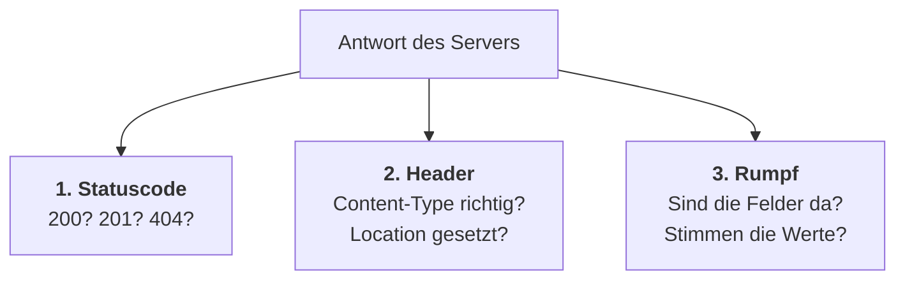

# Testfälle formulieren

## Warum aufschreiben, was man ohnehin ausprobiert?

Beim Entwickeln probiert man ständig etwas aus: Endpunkt aufrufen, Ergebnis ansehen, weitermachen. Das fühlt sich nach Testen an — ist aber keines.

Was dabei fehlt:

- **Nachvollziehbarkeit.** In drei Wochen weißt du nicht mehr, was du geprüft hast.
- **Vollständigkeit.** Man probiert, was einem gerade einfällt. Meist nur der Fall, der funktioniert.
- **Übertragbarkeit.** Jemand anderes kann dein Ergebnis nicht wiederholen.

:::danger Der häufigste Fehler beim Testen
Man testet nur den **Gutfall** — die Eingabe, die funktionieren soll.

Fehler stecken aber fast immer in den anderen Fällen: leere Eingabe, unbekannte Id, doppelter Aufruf, falsches Format. Genau die probiert niemand freiwillig aus.
:::

## Der Aufbau eines Testfalls

Ein Testfall hat vier Bestandteile. Fehlt einer, ist er nicht überprüfbar.

| Bestandteil | Frage | Beispiel |
|---|---|---|
| **Bezeichnung** | Was wird geprüft? | „Unbekannte Id liefert 404" |
| **Vorbedingung** | Welcher Zustand muss vorher herrschen? | „Anwendung läuft, es gibt keine Person mit Id 99" |
| **Testschritte** | Was genau wird getan? | „GET auf `/api/v1/persons/99`" |
| **Erwartetes Ergebnis** | Was muss dabei herauskommen? | „Status 404, Rumpf enthält `detail`" |

:::warning Das erwartete Ergebnis wird **vorher** festgelegt
Wer erst ausführt und dann aufschreibt, was herauskam, hat nichts geprüft — er hat protokolliert.

Der Testfall entscheidet vorher, was richtig ist. Erst dadurch kann er überhaupt fehlschlagen.
:::

### Gut und schlecht formuliert

| ❌ Schlecht | ✅ Gut | Warum |
|---|---|---|
| „Endpunkt testen" | „GET auf `/api/v1/persons/1` liefert Status 200 und `firstname` = `Anna`" | prüfbar statt vage |
| „Es kommt was Sinnvolles" | „Status 404, Feld `detail` enthält die Id" | nachprüfbar |
| „Person anlegen klappt" | „POST liefert 201, Antwort enthält ein Feld `id`" | benennt das Kriterium |
| „Fehler wird angezeigt" | „Status 400, **nicht** 500" | grenzt ab |

:::tip Formuliere auch, was **nicht** passieren darf
„Status 400, nicht 500" ist stärker als „Status 400". Es schließt eine typische Verwechslung ausdrücklich aus.

Genauso: „Es wird **keine** neue Person angelegt."
:::

## Testfälle systematisch finden

Nicht raten — es gibt zwei Verfahren, die du aus dem ersten Lehrjahr kennst.

### Äquivalenzklassen

Teile alle möglichen Eingaben in Gruppen, die sich **gleich verhalten**. Aus jeder Gruppe genügt ein Vertreter.

Beispiel: Ein Endpunkt `GET /api/v1/persons/{id}`.

| Klasse | Beispielwert | Erwartung |
|---|---|---|
| gültige, vorhandene Id | `1` | 200 mit Daten |
| gültige, nicht vorhandene Id | `99` | 404 |
| keine Zahl | `abc` | 400 |
| negative Zahl | `-1` | 404 oder 400 |

Vier Testfälle statt tausend Einzelwerte — und die Abdeckung ist besser als bei zufälligem Probieren.

### Grenzwertanalyse

Fehler sitzen an den **Rändern** der Klassen, nicht in ihrer Mitte. Wenn ein Kommentar zwischen 5 und 500 Zeichen lang sein darf, prüfst du:

```text
        4        5              500      501
        ↓        ↓               ↓        ↓
   ─────┼────────┼───────────────┼────────┼─────
      ungültig │      gültig      │  ungültig
```

Also genau vier Werte: `4`, `5`, `500`, `501` — jeweils direkt unter und auf der Grenze.

:::info Warum gerade die Ränder?
Weil dort die Vergleichsoperatoren sitzen. Ein `<` statt `<=` verschiebt die Grenze um genau eins — mit einem Wert aus der Mitte fällt das nie auf.
:::

## Was man bei einer REST-Schnittstelle prüft

Bei einem Webservice reicht es nicht, auf den Inhalt zu schauen. Zu jedem Aufruf gehören drei Ebenen:



Dazu kommt eine vierte, die man leicht vergisst:

**4. Der Zustand danach.** Ist der Datensatz wirklich in der Datenbank gelandet? Ist er nach dem `DELETE` wirklich weg? Eine Antwort mit `201` beweist noch nicht, dass gespeichert wurde.

:::tip Deshalb bestehen viele Testfälle aus zwei Schritten
„`DELETE` auf `/persons/2`" **und** „danach `GET` auf `/persons/2`".

Der erste Schritt löst aus, der zweite prüft die Wirkung.
:::

## Eine Prüfliste für REST-Endpunkte

Geh diese Punkte für jeden Endpunkt durch:

| Frage | Typischer Testfall |
|---|---|
| Funktioniert der Normalfall? | Gültige Anfrage → erwarteter Statuscode und Inhalt |
| Was bei unbekannter Id? | → `404`, nicht `200` mit leerem Inhalt |
| Was bei fehlerhaftem JSON? | → `400`, nicht `500` |
| Was bei falscher HTTP-Methode? | → `405` |
| Was, wenn die Sammlung leer ist? | → `200` mit `[]`, nicht `404` |
| Was bei zweimaligem Aufruf? | Idempotenz prüfen |
| Ist die Wirkung eingetreten? | Nachfolgender Aufruf oder Blick in die Datenbank |

## Vom Testfall zum automatischen Test

Die Testfälle, die du von Hand ausführst, sind bereits der Bauplan für automatisierte Tests. Der Aufbau ist derselbe:

| Testfall auf dem Papier | Im Testcode |
|---|---|
| Vorbedingung | *Arrange* — Ausgangslage herstellen |
| Testschritte | *Act* — auslösen |
| Erwartetes Ergebnis | *Assert* — prüfen |

Dieses Muster heißt **Arrange–Act–Assert**. Ein handschriftlicher Testfall lässt sich fast Zeile für Zeile übersetzen — deshalb lohnt es sich, ihn ordentlich zu formulieren, auch wenn man ihn zunächst von Hand ausführt.

:::note Das hast du gelernt
- Ein Testfall braucht **Bezeichnung, Vorbedingung, Schritte und erwartetes Ergebnis**.
- Das erwartete Ergebnis wird **vor** der Ausführung festgelegt.
- **Äquivalenzklassen** reduzieren die Zahl der Fälle, **Grenzwertanalyse** findet die typischen Fehler.
- Bei REST prüft man **Statuscode, Header, Rumpf** — und den **Zustand danach**.
- Fehlerfälle sind wichtiger als der Gutfall, weil dort die Fehler sitzen.
- Ein guter Testfall lässt sich später fast unverändert in einen automatisierten Test übersetzen.
:::
