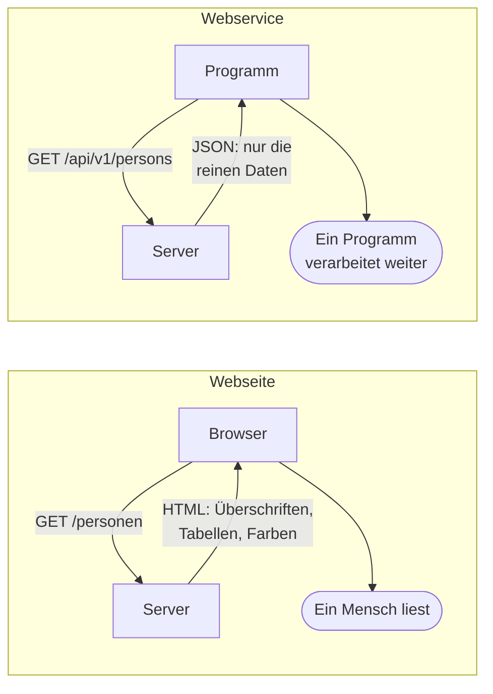
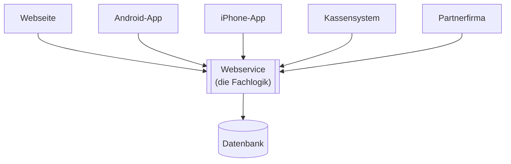
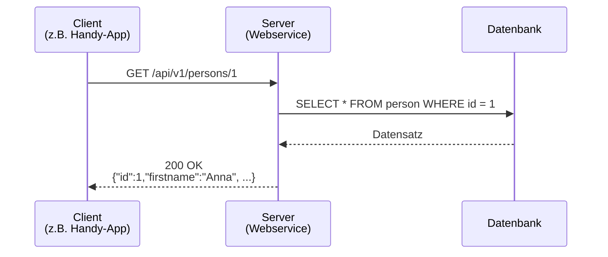

# Was ist ein Webservice?

## Die Ausgangslage: Programme müssen miteinander reden

Du kennst Programme, die ein Mensch bedient: Eine Oberfläche mit Knöpfen, Feldern und Listen. Der Mensch klickt, das Programm reagiert.

Sehr viel häufiger ist aber ein anderer Fall: **Ein Programm braucht etwas von einem anderen Programm.** Niemand sitzt davor, niemand klickt.

Ein paar Beispiele aus dem Alltag:

| Situation | Wer fragt? | Wen fragt er? |
|---|---|---|
| Eine Wetter-App zeigt die Vorhersage für Bremen | die App auf dem Handy | den Server des Wetterdienstes |
| Ein Onlineshop prüft, ob die Kreditkarte gedeckt ist | der Shop-Server | den Server des Zahlungsdienstleisters |
| Die Schulverwaltung übernimmt Noten ins Zeugnisprogramm | das Zeugnisprogramm | den Server der Schulverwaltung |
| Eine Paketverfolgung zeigt „Sendung in Zustellung" | die Website des Versenders | den Server von DHL |

In keinem dieser Fälle öffnet ein Mensch eine Webseite beim anderen Anbieter und tippt etwas ab. Die Programme reden **direkt miteinander**.

Genau dafür gibt es Webservices.

:::info Definition
Ein **Webservice** ist ein Programm, das seine Funktionen über ein Netzwerk anderen Programmen zur Verfügung stellt — nicht Menschen.
:::

## Der Unterschied zu einer Webseite

Beides läuft über dasselbe Protokoll (HTTP) und oft über denselben Server. Der Unterschied liegt darin, **wer die Antwort lesen soll**.



Dieselbe Information, zwei Verpackungen:

**Als Webseite (HTML)** — für Menschen gedacht, enthält Darstellungsanweisungen:

```html
<div class="person-karte">
  <h2>Anna Schmidt</h2>
  <p class="hinweis">Kundennummer: <strong>1</strong></p>
</div>
```

**Als Webservice-Antwort (JSON)** — für Programme gedacht, enthält nur Daten:

```json
{ "id": 1, "firstname": "Anna", "surname": "Schmidt" }
```

:::tip Der Kern des Unterschieds
HTML sagt, **wie etwas aussehen soll**. JSON sagt, **was es ist**.

Ein Programm interessiert sich nicht für Schriftgrößen. Es will wissen: Wie heißt das Feld, und was steht drin?
:::

## Warum baut man das überhaupt?

Man könnte ja auch die Datenbank direkt freigeben. Warum der Umweg über einen Webservice?

**1. Die Datenbank bleibt geschützt.**
Der Webservice entscheidet, wer was sehen und ändern darf. Eine direkt erreichbare Datenbank hätte diesen Wächter nicht.

**2. Die Innereien bleiben austauschbar.**
Wenn hinter dem Webservice die Datenbank gewechselt wird, merken die aufrufenden Programme davon nichts — solange die Schnittstelle gleich bleibt.

**3. Viele verschiedene Clients, eine Quelle.**
Webseite, Android-App, iPhone-App, Kassensystem und Partnerfirma greifen auf **denselben** Webservice zu. Die Fachlogik existiert genau einmal.



**4. Man kann sich Arbeit sparen.**
Kaum jemand baut seine eigene Kartendarstellung, Adressprüfung oder Bezahlabwicklung. Man ruft einen fremden Webservice auf.

## Fachbegriffe, die dir begegnen werden

| Begriff | Bedeutung |
|---|---|
| **API** | *Application Programming Interface*, deutsch: Programmierschnittstelle. Die Menge aller Funktionen, die ein Programm nach außen anbietet. Jeder Webservice ist eine API — aber nicht jede API ist ein Webservice (auch eine Java-Bibliothek hat eine API). |
| **Client** | Das Programm, das **fragt**. |
| **Server** | Das Programm, das **antwortet**. |
| **Endpunkt** | Eine einzelne aufrufbare Adresse des Webservice, z. B. `/api/v1/persons/1`. |
| **Request** | Die Anfrage des Clients. |
| **Response** | Die Antwort des Servers. |
| **Backend** | Der Teil einer Anwendung, der im Hintergrund läuft und keine Oberfläche hat — meist genau der Webservice. |
| **Frontend** | Der Teil, den der Nutzer sieht und bedient. |

:::warning Client und Server sind Rollen, keine Geräte
Derselbe Rechner kann in einer Anfrage Client und in der nächsten Server sein. Ein Onlineshop ist **Server** gegenüber dem Browser des Kunden und gleichzeitig **Client** gegenüber dem Zahlungsdienstleister.
:::

## Wie sieht so ein Aufruf konkret aus?

Ein Webservice-Aufruf besteht immer aus zwei Nachrichten: Anfrage hin, Antwort zurück.



Die Anfrage im Klartext:

```http
GET /api/v1/persons/1 HTTP/1.1
Host: localhost:8080
Accept: application/json
```

Die Antwort:

```http
HTTP/1.1 200 OK
Content-Type: application/json

{"id":1,"firstname":"Anna","surname":"Schmidt"}
```

Mehr zum Aufbau dieser Nachrichten steht im Infoblatt **HTTP kompakt**.

## Zwei Baustile für Webservices

Webservice sagt noch nichts darüber, **wie** die Nachrichten aufgebaut sind. Dafür gibt es verschiedene Baustile. Die beiden wichtigsten:

- **REST** — der heute vorherrschende Stil für Web- und Mobil-APIs. Damit arbeitest du in diesen Tutorials.
- **SOAP** — der ältere, streng geregelte Standard. In Banken, Versicherungen und Behörden noch weit verbreitet.

Beide werden im Infoblatt **Das REST-Paradigma** gegenübergestellt.

:::note Das hast du gelernt
- Ein Webservice stellt Funktionen **für andere Programme** bereit, nicht für Menschen.
- Er liefert **Daten** (meist JSON) statt **Darstellung** (HTML).
- Er schützt die Datenbank, entkoppelt die Innereien und bedient viele Clients aus einer Quelle.
- Client und Server sind **Rollen** in einem Aufruf, keine Gerätetypen.
:::
