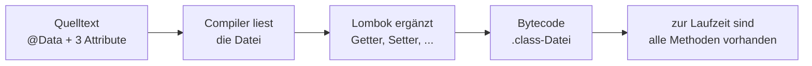

# Lombok

:::warning Vorsicht bei Entitäten mit Beziehungen
`@Data` erzeugt `toString()`, `equals()` und `hashCode()` über alle Felder. Bei
Klassen, die aufeinander zeigen, drehen sich diese Methoden im Kreis. Warum das
so ist und was stattdessen zu tun ist, steht unter
[Beziehungen mit JPA abbilden](/infoblaetter/jpa-beziehungen).
:::

## Das Problem: Code, der nichts aussagt

Sieh dir die Klasse `Person` aus dem ersten Tutorial an:

```java
public class Person {
    private Long id;
    private String firstname;
    private String surname;

    public Person() { }

    public Long getId() { return id; }
    public void setId(Long id) { this.id = id; }

    public String getFirstname() { return firstname; }
    public void setFirstname(String firstname) { this.firstname = firstname; }

    public String getSurname() { return surname; }
    public void setSurname(String surname) { this.surname = surname; }
}
```

Drei Zeilen sagen etwas über Personen aus. Die übrigen fünfzehn sind **immer gleich** — sie folgen mechanisch aus den Attributnamen. Solchen Code nennt man **Boilerplate**: notwendig, aber inhaltsleer.

Bei einer Klasse mit acht Attributen wächst das auf über sechzig Zeilen. Der eigentliche Inhalt geht darin unter.

:::info Was Lombok ist
Eine Bibliothek, die diesen Code **beim Kompilieren** erzeugt. Im Quelltext steht nur eine Annotation; die Methoden entstehen erst im Bytecode.
:::

Dieselbe Klasse mit Lombok:

```java
@Data
public class Person {
    private Long id;
    private String firstname;
    private String surname;
}
```

## Wie es funktioniert

Lombok ist ein **Annotation Processor** — ein Programm, das sich in den Übersetzungsvorgang einhängt.



Der Compiler baut aus dem Quelltext zunächst eine Baumstruktur. Lombok verändert diesen Baum, bevor der Bytecode entsteht. Deshalb ist der erzeugte Code **nirgends als Text zu finden** — er existiert nur in der `.class`-Datei.

:::warning Zwei Folgen, die anfangs verwirren
**1. Die Entwicklungsumgebung braucht ein Plugin.** Ohne es kennt sie `person.getFirstname()` nicht und unterringelt es rot — obwohl `mvnw compile` einwandfrei durchläuft. IntelliJ bringt das Plugin heute mit; falls nicht, über *File → Settings → Plugins* nachinstallieren.

**2. Du kannst den erzeugten Code nicht öffnen.** Suche nicht nach einer Datei mit den Gettern. In IntelliJ lässt sich der Bytecode über *View → Show Bytecode* ansehen, wenn du es genau wissen willst.
:::

## Die wichtigsten Annotationen

| Annotation | Erzeugt |
|---|---|
| `@Getter` | Lesemethoden für alle Attribute |
| `@Setter` | Schreibmethoden für alle Attribute |
| `@NoArgsConstructor` | parameterlosen Konstruktor |
| `@AllArgsConstructor` | Konstruktor mit allen Attributen |
| `@ToString` | `toString()` |
| `@EqualsAndHashCode` | `equals()` und `hashCode()` |
| `@Data` | Getter, Setter, `toString()`, `equals()`/`hashCode()` — und `@RequiredArgsConstructor` |
| `@RequiredArgsConstructor` | Konstruktor mit allen `final`-Attributen |

### `@Data` ist ein Bündel

```java
@Data
// entspricht:
// @Getter @Setter @ToString @EqualsAndHashCode @RequiredArgsConstructor
```

Das ist bequem — und genau darin liegt auch das Risiko: Man bekommt Methoden, über die man nicht nachgedacht hat.

:::danger `@Data` erzeugt **keinen** parameterlosen Konstruktor
Das ist die Falle, die am häufigsten zuschnappt. `@RequiredArgsConstructor` erzeugt einen Konstruktor mit allen `final`- und `@NonNull`-Feldern.

Hat eine Klasse **kein** solches Feld, ist dieser Konstruktor zufällig parameterlos — und alles funktioniert. Sobald aber ein einziges `final`-Feld dazukommt, ist der parameterlose Konstruktor weg. Für eine JPA-Entität heißt das: Sie lässt sich nicht mehr laden, mit einer schwer lesbaren Fehlermeldung beim Start.

**Deshalb schreibt man an eine Entität immer beides:**

```java
@Entity
@Data
@NoArgsConstructor
public class GuestbookEntry { ... }
```
:::

### Einzelne Attribute steuern

Die Annotationen lassen sich auch am Attribut setzen, nicht nur an der Klasse:

```java
@Data
public class GuestbookEntry {

    @Setter(AccessLevel.NONE)      // kein Setter für dieses Feld
    private LocalDateTime date;

    @ToString.Exclude              // nicht in toString() aufnehmen
    private String comment;
}
```

## Wo Vorsicht angebracht ist

Lombok nimmt Arbeit ab, aber nicht Verantwortung. Zwei Stellen sind heikel.

### `@Data` auf Entitäten

`@Data` erzeugt `equals()` und `hashCode()` **über alle Attribute**. Bei einer JPA-Entität ist das problematisch:

- Der Vergleich zieht die `id` mit ein. Ein noch nicht gespeichertes Objekt hat `id = null` — nach dem Speichern eine Nummer. Damit ändert sich sein `hashCode()`, obwohl es dasselbe Objekt ist.
- Hat eine Entität Beziehungen zu anderen, laufen `toString()` und `equals()` in die Referenzen hinein. Zeigen zwei Entitäten aufeinander, entsteht eine **Endlosschleife**.

:::tip Für dieses Tutorial ist `@Data` vertretbar
Das Gästebuch hat genau **eine** Entität ohne Beziehungen. Die Endlosschleife kann hier nicht entstehen.

Der erste Punkt gilt allerdings weiterhin: Auch ohne jede Beziehung ändert sich der `hashCode()` in dem Moment, in dem die Datenbank die `id` vergibt. Wer eine noch nicht gespeicherte Entität in ein `HashSet` legt, findet sie nach dem Speichern nicht mehr wieder. In diesem Tutorial passiert das nicht — wissen sollte man es trotzdem.

Sobald Entitäten aufeinander verweisen, nimmt man stattdessen die einzelnen Annotationen:

```java
@Getter
@Setter
@NoArgsConstructor
public class ArticleEntity { ... }
```

Sobald Entitäten aufeinander verweisen — etwa Lieferanten und ihre Artikel — wird das wichtig.
:::

### Fachliche Regeln gehören nicht in einen Setter

Lombok erzeugt Setter, die **jeden** Wert annehmen. Soll ein Wert geprüft werden, schreibt man die Methode selbst — Lombok überschreibt vorhandene Methoden nicht.

## Lombok und Records

Beides reduziert Boilerplate, aber für verschiedene Zwecke:

| | Record | Lombok `@Data` |
|---|---|---|
| Veränderbar | **nein**, unveränderlich | ja, mit Settern |
| Parameterloser Konstruktor | nein | nur ohne `final`-Felder — sonst `@NoArgsConstructor` |
| Teil der Sprache | **ja**, seit Java 16 | nein, zusätzliche Bibliothek |
| Geeignet für | Antwortobjekte, Datenübertragung | Entitäten, veränderliche Objekte |

:::info Die Entscheidungsregel
**Soll sich das Objekt nach dem Erzeugen nicht mehr ändern?** → Record.
**Muss es veränderbar sein — etwa weil Hibernate die `id` nachträglich setzt?** → gewöhnliche Klasse, gern mit Lombok.

Deshalb ist `Greeting` aus dem ersten Tutorial ein Record und `GuestbookEntry` eine Klasse mit `@Data`.
:::

## Wird Lombok noch verwendet?

Ja, weit verbreitet — vor allem für JPA-Entitäten, wo Records nicht in Frage kommen. Gleichzeitig ist ein Rückgang zu beobachten: Für unveränderliche Datenklassen haben Records Lombok überflüssig gemacht, und manche Teams verzichten bewusst darauf, weil ein zusätzlicher Eingriff in den Übersetzungsvorgang bei Java-Versionswechseln gelegentlich Ärger macht.

In deinem Ausbildungsbetrieb wirst du beides antreffen.

:::note Das hast du gelernt
- **Lombok** erzeugt Boilerplate wie Getter, Setter und Konstruktoren **beim Kompilieren**.
- Der erzeugte Code steht nirgends im Quelltext — die Entwicklungsumgebung braucht dafür ein Plugin.
- `@Data` bündelt Getter, Setter, `toString()`, `equals()`, `hashCode()` — und `@RequiredArgsConstructor`. Einen parameterlosen Konstruktor bekommst du nur, solange die Klasse kein `final`-Feld hat; an eine Entität schreibt man deshalb `@NoArgsConstructor` dazu.
- Bei Entitäten **mit Beziehungen** ist `@Data` gefährlich (Endlosschleifen, wechselnder `hashCode`) — dort nimmt man die einzelnen Annotationen.
- **Record** für unveränderliche Objekte, **Lombok** für veränderliche.
:::

## Weiterlesen

- [Werkzeuge in IntelliJ](/infoblaetter/werkzeuge-intellij) — die Anmerkungsverarbeitung einschalten, wenn die Getter fehlen
- [Beziehungen mit JPA abbilden](/infoblaetter/jpa-beziehungen) — warum die Sammel-Annotation an einer Entität mit Beziehungen gefährlich ist
- [DTOs und Schichten](/infoblaetter/dto-schichten) — wo ein `record` besser passt als Lombok
