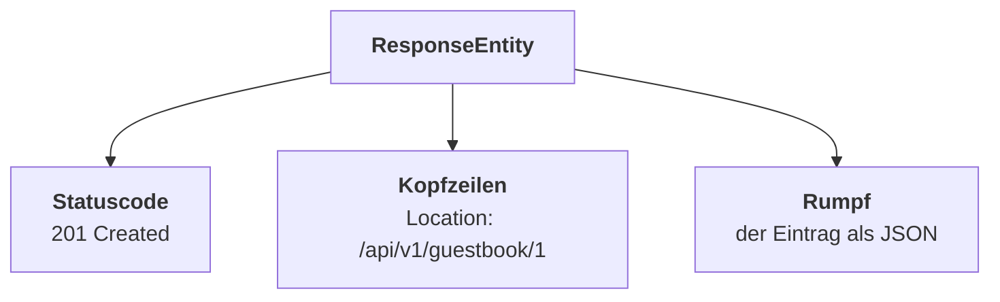

# AB 02 – Antworten gestalten

## Die Situation

> Das Frontend-Team hat begonnen, das Gästebuch anzubinden — und meldet ein Problem zurück:
>
> *„Wenn wir einen Eintrag anlegen, bekommen wir zwar 201 zurück, aber wir wissen nicht, unter welcher Adresse der neue Eintrag erreichbar ist. Wir müssen die URL im Frontend selbst zusammenbauen. Und wenn ihr die Pfade mal ändert, geht das kaputt."*

Eine berechtigte Beschwerde. Sehen wir uns an, warum das mit deinem bisherigen Code nicht zu lösen ist.

## Lernziele

Nach Bearbeitung dieses Arbeitsblatts kannst du:

- begründen, warum `@ResponseStatus` für manche Antworten nicht ausreicht
- **`ResponseEntity`** einsetzen, um Statuscode, Kopfzeilen und Rumpf gemeinsam festzulegen
- nach dem Anlegen einer Ressource einen korrekten **`Location`**-Header liefern
- den passenden Statuscode für jede Operation wählen und begründen
- **Postman** benutzen, um Anfragen zu sammeln und auszuführen

## Das Problem

Dein POST-Endpunkt sieht so aus:

```java
@PostMapping
@ResponseStatus(HttpStatus.CREATED)
public GuestbookEntry createEntry(@RequestBody GuestbookEntry entry) {
    return repository.save(entry);
}
```

Die Annotation `@ResponseStatus` kann genau eine Sache: den Statuscode festlegen. Und zwar **fest**, für alle Aufrufe gleich.

Was sie **nicht** kann:

- eine Kopfzeile setzen — etwa `Location` mit der Adresse des neuen Eintrags
- den Statuscode **abhängig von der Situation** wählen

:::info Was `Location` soll
Beim Anlegen einer Ressource gehört laut HTTP-Standard die Adresse der neuen Ressource in die Antwort:

```http
HTTP/1.1 201 Created
Location: http://localhost:8080/api/v1/guestbook/1
```

Der Client muss dann nichts zusammenbauen — er liest die fertige Adresse ab. Ändert sich später der Pfad, funktioniert er trotzdem weiter.
:::

Der Rückgabewert deiner Methode ist ein `GuestbookEntry`. Damit ist der Rumpf beschrieben — für Status und Kopfzeilen bleibt kein Platz. Genau diese Lücke schließt `ResponseEntity`.

## `ResponseEntity`: die ganze Antwort in einem Objekt

Eine HTTP-Antwort besteht aus drei Teilen. `ResponseEntity` fasst alle drei zusammen:



Statt des Objekts gibt die Methode nun eine `ResponseEntity` **um** das Objekt zurück:

```java
public GuestbookEntry createEntry(...)                  // vorher
public ResponseEntity<GuestbookEntry> createEntry(...)  // nachher
```

Der Typ in den spitzen Klammern sagt, was im Rumpf steckt.

## Aufgaben

### Aufgabe 1 – Den POST-Endpunkt umbauen

<Task id="t2-ab02-a1">Ersetze den POST-Endpunkt durch diese Fassung:</Task>

```java
@PostMapping
public ResponseEntity<GuestbookEntry> createEntry(@RequestBody GuestbookEntry entry) {
    GuestbookEntry saved = repository.save(entry);

    URI location = ServletUriComponentsBuilder.fromCurrentRequest()
            .path("/{id}")
            .buildAndExpand(saved.getId())
            .toUri();

    return ResponseEntity.created(location).body(saved);
}
```

Die Annotation `@ResponseStatus` entfällt — der Status steckt jetzt in `ResponseEntity.created(...)`.

:::tip Warum die Adresse nicht einfach zusammensetzen?
Man könnte schreiben:

```java
URI location = URI.create("http://localhost:8080/api/v1/guestbook/" + saved.getId());  // ❌
```

Das funktioniert genau so lange, bis die Anwendung auf einem echten Server unter einem anderen Namen läuft. `ServletUriComponentsBuilder.fromCurrentRequest()` nimmt die Adresse der **aktuellen Anfrage** als Ausgangspunkt und hängt die Id an. Damit stimmt sie immer.
:::

<Task id="t2-ab02-a1-test">Lege einen Eintrag an und sieh dir die **Kopfzeilen** der Antwort an — nicht nur den Rumpf. In der `.http`-Datei zeigt die Entwicklungsumgebung sie an, im Browser über F12 → Netzwerk.</Task>

Du müsstest sehen:

```http
HTTP/1.1 201
Location: http://localhost:8080/api/v1/guestbook/1
```

### Aufgabe 2 – Die übrigen Endpunkte

Jetzt lassen sich alle Antworten einheitlich gestalten. `ResponseEntity` bietet für die gängigen Fälle fertige Methoden:

| Aufruf | Ergebnis |
|---|---|
| `ResponseEntity.ok(objekt)` | `200 OK` mit Rumpf |
| `ResponseEntity.created(uri).body(objekt)` | `201 Created` mit `Location` |
| `ResponseEntity.noContent().build()` | `204 No Content`, kein Rumpf |
| `ResponseEntity.notFound().build()` | `404 Not Found` |

:::note `build()` oder `body()`?
`body(...)` hängt einen Rumpf an. `build()` schließt die Antwort **ohne** Rumpf ab — das braucht man bei `204`, wo es nichts zurückzugeben gibt.
:::

<Task id="t2-ab02-a2-getall">Baue den Endpunkt für alle Einträge auf `ResponseEntity` um.</Task>

<Task id="t2-ab02-a2-getone">Ergänze einen Endpunkt, der einen Eintrag anhand seiner Id liefert:</Task>

```java
@GetMapping("/{id}")
public ResponseEntity<GuestbookEntry> findEntryById(@PathVariable Long id) {
    return repository.findById(id)
            .map(ResponseEntity::ok)
            .orElseThrow(() -> new ResponseStatusException(
                    HttpStatus.NOT_FOUND, "Kein Gästebucheintrag mit der Id " + id));
}
```

:::info Diese drei Zeilen genauer angesehen
`findById()` kennst du aus dem ersten Tutorial: Es liefert kein Objekt, sondern ein **`Optional`** — einen Behälter, in dem ein Eintrag liegen kann oder eben nicht.

Ausgeschrieben täte der Endpunkt genau dasselbe:

```java
Optional<GuestbookEntry> found = repository.findById(id);

if (found.isPresent()) {
    return ResponseEntity.ok(found.get());
}
throw new ResponseStatusException(
        HttpStatus.NOT_FOUND, "Kein Gästebucheintrag mit der Id " + id);
```

Die kurze Fassung sagt dasselbe — mit drei Schreibweisen, die du so noch nicht benutzt hast.

**`.map(...)` — mach etwas mit dem Inhalt, falls einer da ist.**
Liegt ein Eintrag im Behälter, wird er umgewandelt und wieder eingepackt. Ist der Behälter leer, bleibt er leer — dann wird gar nichts ausgeführt. Aus dem Eintrag wird so eine fertige `200`-Antwort, die weiterhin im Behälter steckt. `orElseThrow` packt sie am Ende aus.

**Der Pfeil `->` — eine Funktion ohne Namen.**
`() -> new ResponseStatusException(...)` heißt: „nimm nichts entgegen und liefere eine neue Ausnahme". Du übergibst hier keinen fertigen *Wert*, sondern eine *Vorschrift*, die nur dann ausgeführt wird, wenn sie gebraucht wird — bei einer unbekannten Id. Diese Schreibweise heißt **Lambda-Ausdruck**; im ersten Tutorial stand sie schon einmal da, ohne dass sie einen Namen bekommen hätte.

**Der Doppel-Doppelpunkt `::` — dasselbe noch kürzer.**
`ResponseEntity::ok` ist die Kurzform von `entry -> ResponseEntity.ok(entry)` und heißt: „ruf damit `ResponseEntity.ok` auf". Das nennt man eine **Methodenreferenz**.

Beide Fassungen sind richtig, und die ausgeschriebene ist nicht schlechter. Die kurze steht hier, weil sie dir in Spring-Projekten überall begegnen wird.
:::

<Task id="t2-ab02-a2-put">Implementiere den Endpunkt zum Ändern eines Eintrags. Titel, Kommentar und Verfasser dürfen sich ändern — das Datum nicht.</Task>

<Task id="t2-ab02-a2-delete">Implementiere den Endpunkt zum Löschen. Erfolg: `204`. Unbekannte Id: `404`.</Task>

:::warning Denk an die Prüfung vor dem Löschen
`deleteById()` wirft bei einer unbekannten Id keine Ausnahme, sondern tut nichts. Ohne vorherige Prüfung mit `existsById()` würde jeder Löschversuch mit `204` antworten — auch für Einträge, die es nie gab.
:::

<details>
<summary>Wenn du nicht weiterkommst – so sehen die beiden Endpunkte aus</summary>

```java
@PutMapping("/{id}")
public ResponseEntity<GuestbookEntry> updateEntry(@PathVariable Long id,
                                                  @RequestBody GuestbookEntry entry) {
    GuestbookEntry existing = repository.findById(id)
            .orElseThrow(() -> new ResponseStatusException(
                    HttpStatus.NOT_FOUND, "Kein Gästebucheintrag mit der Id " + id));

    existing.setTitle(entry.getTitle());
    existing.setComment(entry.getComment());
    existing.setAuthor(entry.getAuthor());

    return ResponseEntity.ok(repository.save(existing));
}

@DeleteMapping("/{id}")
public ResponseEntity<Void> deleteEntryById(@PathVariable Long id) {
    if (!repository.existsById(id)) {
        throw new ResponseStatusException(
                HttpStatus.NOT_FOUND, "Kein Gästebucheintrag mit der Id " + id);
    }
    repository.deleteById(id);
    return ResponseEntity.noContent().build();
}
```

Zwei Stellen lohnen einen zweiten Blick:

**Beim Ändern wird der vorhandene Eintrag geladen** und es werden nur drei Felder übernommen. Würdest du stattdessen das hereingereichte `entry` direkt speichern, käme dessen `date` aus dem Rumpf der Anfrage — also `null`. Das Datum bleibt nur erhalten, wenn du das gespeicherte Objekt änderst statt es zu ersetzen.

**`ResponseEntity<Void>`** beim Löschen: In den spitzen Klammern steht, was im Rumpf liegt. Bei `204` liegt dort nichts — dafür steht `Void`.

</details>

### Aufgabe 3 – Statuscodes systematisch

Deine API antwortet je nach Situation mit einem anderen Statuscode. Ordne zu:

<Task id="t2-ab02-a3">Trage in die Tabelle ein, welchen Statuscode dein Dienst liefert. Fülle sie erst aus dem Kopf aus und decke die Auflösung danach auf.</Task>

<FillInTable
  storageKey="t2-ab02-statuscodes"
  spalteLinks="Situation"
  spalteRechts="Dein Statuscode"
  platzhalter="z. B. 200"
  zeilen={[
    {id: 'post-ok', links: 'Eintrag erfolgreich angelegt', loesung: '201', klartext: '201 Created'},
    {id: 'get-all', links: 'Alle Einträge abgerufen', loesung: '200', klartext: '200 OK'},
    {id: 'get-404', links: 'Eintrag mit unbekannter Id abgerufen', loesung: '404', klartext: '404 Not Found'},
    {id: 'del-ok', links: 'Eintrag erfolgreich gelöscht', loesung: '204', klartext: '204 No Content'},
    {id: 'del-404', links: 'Eintrag mit unbekannter Id gelöscht', loesung: '404', klartext: '404 Not Found'},
    {id: 'json-kaputt', links: 'JSON im Rumpf war fehlerhaft', loesung: '400', klartext: '400 Bad Request'},
    {id: 'del-sammlung', links: <>DELETE auf die <b>Sammlung</b> statt auf einen Eintrag</>, loesung: '405', klartext: '405 Method Not Allowed'},
  ]}
/>

<Task id="t2-ab02-a3-pruefen">Prüfe anschließend jede Zeile durch Ausprobieren. Erst dann weißt du, ob dein Dienst wirklich das tut, was du eingetragen hast.</Task>

Nachschlagen: [HTTP kompakt](/infoblaetter/http-kompakt).

### Aufgabe 4 – Postman

Bisher hast du `.http`-Dateien benutzt. In Betrieben ist **Postman** weit verbreitet — vor allem, weil man Anfragen darin sammeln, gemeinsam nutzen und dokumentieren kann.

<Task id="t2-ab02-a4-collection">Öffne Postman und lege eine neue Collection mit dem Namen **Gästebuch** an.</Task>

<Task id="t2-ab02-a4-get">Erstelle einen `GET`-Request auf `http://localhost:8080/api/v1/guestbook`, speichere ihn und führe ihn aus.</Task>

<Task id="t2-ab02-a4-post">Erstelle einen `POST`-Request auf denselben Pfad. Wähle den Reiter **Body**, dort **raw**, und stelle rechts das Format **JSON** ein. Gib einen Eintrag ein und führe ihn aus.</Task>

<Task id="t2-ab02-a4-headers">Sieh dir in der Antwort den Reiter **Headers** an und finde die Zeile `Location`.</Task>

:::tip Was Postman besser kann als die `.http`-Datei
Antworten werden formatiert dargestellt, Kopfzeilen sind auf einen Blick sichtbar, und man kann eine Collection als Dokumentation exportieren.

Was die `.http`-Datei besser kann: Sie liegt **im Projekt** und wandert mit in die Versionsverwaltung. Beides hat seine Berechtigung — im Betrieb triffst du auf beides.
:::

### Aufgabe 5 – Testfälle

<Task id="t2-ab02-a5">Führe die Testfälle aus. Achte besonders auf die Kopfzeilen, nicht nur auf den Rumpf.</Task>

<TestTable
  storageKey="t2-ab02-tests"
  tests={[
    {
      id: 'TF-01',
      beschreibung: 'Location-Header nach dem Anlegen',
      vorbedingung: 'Anwendung läuft',
      schritte: ['POST auf /api/v1/guestbook mit einem gültigen Eintrag', 'Kopfzeilen der Antwort ansehen'],
      erwartet: <>Status <code>201</code> und eine Kopfzeile <code>Location</code>, die auf <code>/api/v1/guestbook/&#123;id&#125;</code> zeigt.</>
    },
    {
      id: 'TF-02',
      beschreibung: 'Die Location-Adresse funktioniert wirklich',
      vorbedingung: 'TF-01 wurde ausgeführt',
      schritte: ['Die Adresse aus dem Location-Header kopieren', 'Sie als GET aufrufen'],
      erwartet: <>Status <code>200</code>, es kommt genau der eben angelegte Eintrag zurück.</>
    },
    {
      id: 'TF-03',
      beschreibung: 'Unbekannte Id beim Lesen',
      vorbedingung: 'Es gibt keinen Eintrag mit Id 9999',
      schritte: ['GET auf /api/v1/guestbook/9999'],
      erwartet: <>Status <code>404</code>, im Rumpf ein Feld <code>detail</code> mit der Id.</>
    },
    {
      id: 'TF-04',
      beschreibung: 'Löschen liefert keinen Rumpf',
      vorbedingung: 'Ein Eintrag mit bekannter Id existiert',
      schritte: ['DELETE auf diesen Eintrag'],
      erwartet: <>Status <code>204</code>. Die Antwort hat einen <b>leeren</b> Rumpf — nicht <code>null</code> und nicht <code>&#123;&#125;</code>.</>
    },
    {
      id: 'TF-05',
      beschreibung: 'Zweimal löschen',
      vorbedingung: 'TF-04 wurde ausgeführt',
      schritte: ['Denselben DELETE erneut ausführen'],
      erwartet: <>Status <code>404</code> — nicht erneut 204.</>
    },
    {
      id: 'TF-06',
      beschreibung: 'Datum bleibt beim Ändern unverändert',
      vorbedingung: 'Ein Eintrag existiert; sein date wurde notiert',
      schritte: ['PUT mit geändertem Titel und Kommentar', 'Antwort mit dem notierten Wert vergleichen'],
      erwartet: <>Titel und Kommentar sind neu, <code>date</code> ist <b>unverändert</b>.</>
    },
    {
      id: 'TF-07',
      beschreibung: 'Fehlerhaftes JSON',
      vorbedingung: 'Anwendung läuft',
      schritte: ['POST mit dem Rumpf {"title": '],
      erwartet: <>Status <code>400</code> — nicht 500.</>
    }
  ]}
/>

:::note TF-02 ist der eigentliche Beweis
Ein `Location`-Header, der auf eine Adresse zeigt, die es nicht gibt, wäre wertlos. Erst der Aufruf zeigt, dass die Zusage stimmt.

Das ist ein allgemeines Prinzip beim Testen: Prüfe nicht, ob etwas *dasteht*, sondern ob es *funktioniert*.
:::

## Zusammenfassung

:::tip Das hast du gelernt
- `@ResponseStatus` legt nur einen festen Statuscode fest — keine Kopfzeilen, keine Fallunterscheidung.
- **`ResponseEntity`** bündelt Statuscode, Kopfzeilen und Rumpf in einem Objekt.
- Nach dem Anlegen gehört die Adresse der neuen Ressource in den **`Location`**-Header.
- `ServletUriComponentsBuilder.fromCurrentRequest()` baut diese Adresse aus der laufenden Anfrage — statt sie fest zu verdrahten.
- `ok()`, `created()`, `noContent()`, `notFound()` decken die üblichen Fälle ab; `build()` schließt ohne Rumpf ab.
- **Postman** sammelt und dokumentiert Anfragen; die `.http`-Datei liegt dafür im Projekt.
:::

## Selbstkontrolle

1. Nenne zwei Dinge, die `ResponseEntity` kann und `@ResponseStatus` nicht.
2. Wozu dient der `Location`-Header, und bei welchem Statuscode gehört er hin?
3. Warum baut man die Adresse nicht als Zeichenkette zusammen?
4. Wann verwendet man `build()` statt `body()`?
5. Warum genügt es nicht zu prüfen, dass ein `Location`-Header vorhanden ist?

<details>
<summary>Antworten</summary>

1. Kopfzeilen setzen und den Statuscode abhängig von der Situation wählen.
2. Er nennt die Adresse der neu angelegten Ressource, damit der Client sie nicht selbst zusammensetzen muss. Er gehört zu `201 Created`.
3. Weil eine fest verdrahtete Adresse nur auf dem eigenen Rechner stimmt. Sobald die Anwendung unter einem anderen Namen oder Port läuft, wird sie falsch.
4. Bei Antworten ohne Rumpf, typischerweise `204 No Content` und `404 Not Found`.
5. Weil er auf eine Adresse zeigen könnte, unter der nichts erreichbar ist. Erst der Aufruf dieser Adresse beweist, dass die Angabe stimmt.

</details>
